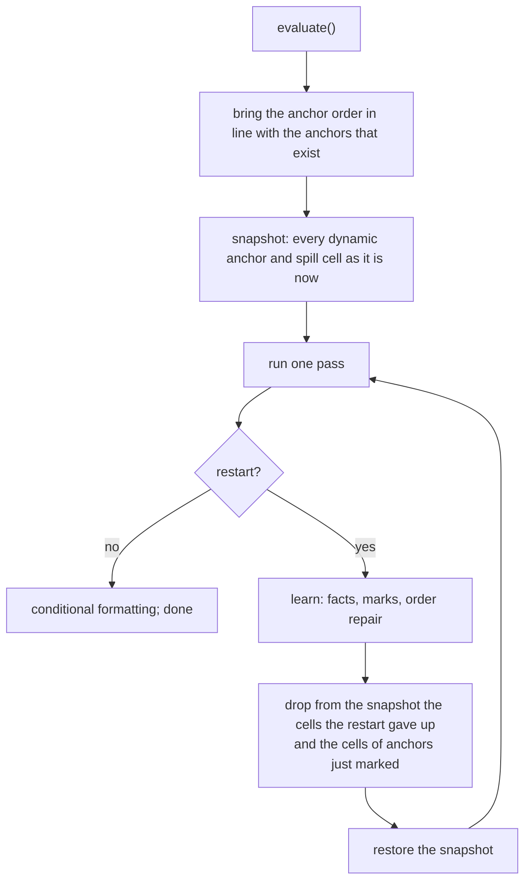
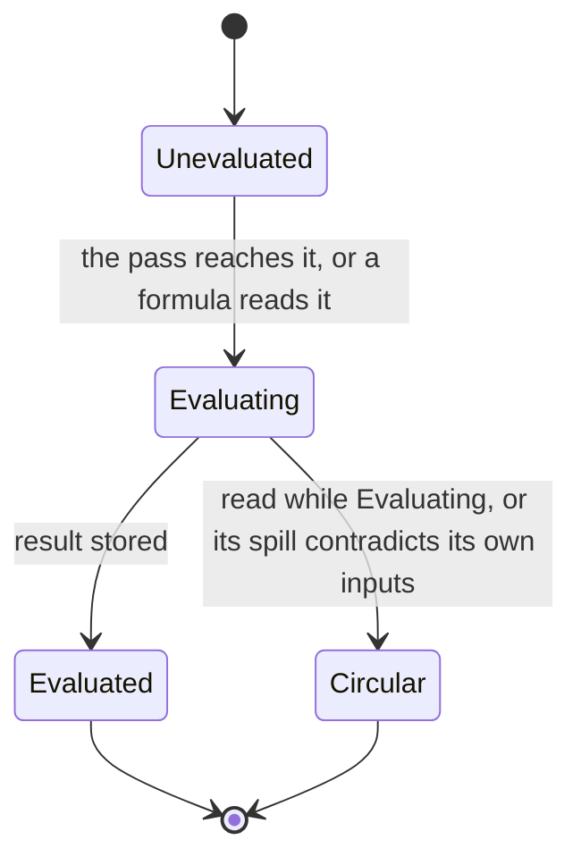
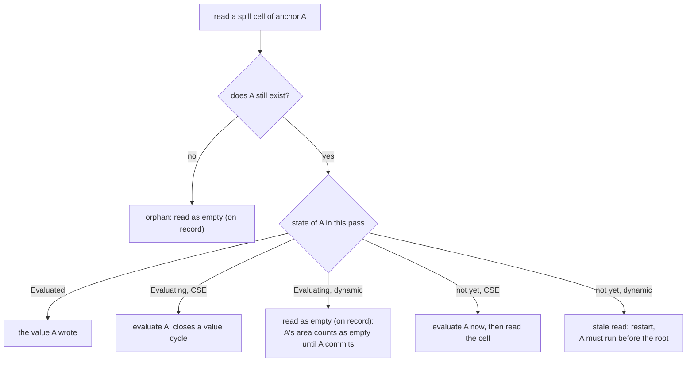
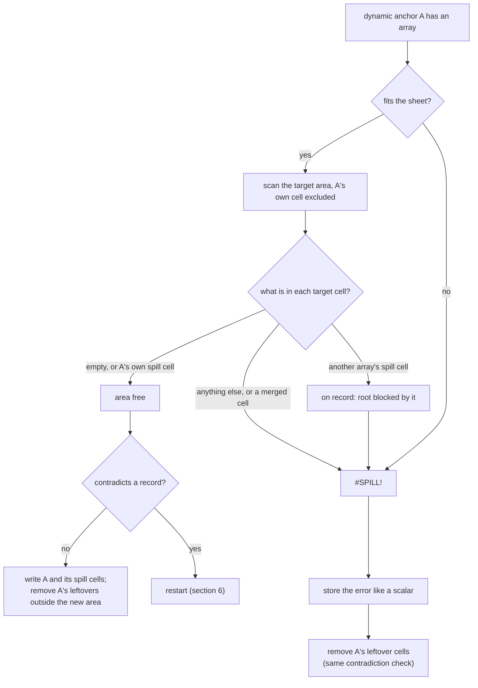
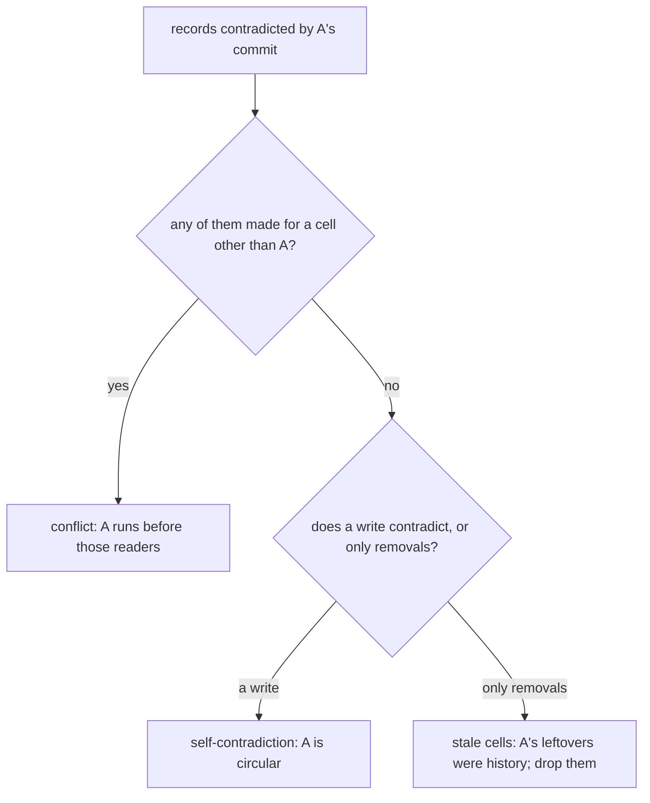
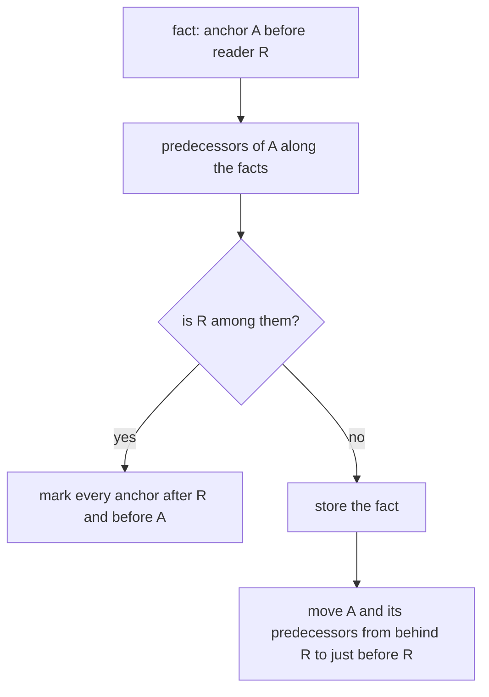

# How IronCalc evaluates a workbook

This document explains the evaluation algorithm: what happens when the
engine recomputes every formula of a workbook. It is written to be read
alongside `base/src/evaluation.rs`, which holds the algorithm, and the
writing side in `base/src/model.rs`. No knowledge of the code is assumed. A
map from the names used here to the functions in the code is at the end.

## 1. What is being computed

A workbook is a set of sheets; a sheet is a grid of positions. A position
may hold nothing, a constant, or a formula. Evaluation computes a value for
every formula and stores it in the cell, so that anyone looking at the sheet
afterwards sees the results.

Formulas read other positions. Most produce a single value, stored in their
own cell. Two kinds produce an *array* of values instead:

- A **dynamic array** formula, for instance `=SEQUENCE(3)` or `=B2:B4`,
  stores its first value in its own cell and *spills* the rest into the cells
  below and to the right. The formula's own cell is the **anchor**; the cells
  it writes are its **spill cells**. Spill cells hold a marker pointing back
  at their anchor, plus the value. How many cells an anchor writes, and
  which ones, is known only once the formula has run: `=SEQUENCE(A1)` is as
  tall as A1 says.
- A **CSE array** formula (the older kind, entered with Ctrl+Shift+Enter)
  occupies a range fixed when it was entered. Its area never changes, so it
  poses none of the problems below and is mentioned only where the code
  treats it separately.

A dynamic array can only spill into cells that are empty. If any target cell
holds something else, a constant, a formula, or another array's spill cell,
the anchor is **blocked**: it stores `#SPILL!` and writes nothing else. When
two arrays want the same cells, the one whose cells are already on the sheet
keeps them and the other is blocked. This is the same rule as Excel's, and
it is what a file saved by Excel encodes.

The result of an evaluation must be **consistent**: every formula, if run
again against the final sheet, would give the value stored in its cell, and
every dynamic array either occupies its area or is blocked and says so. The
only cells allowed to hold something their formula would not give are the
ones marked circular, which hold `#CIRC!`.

## 2. Why dynamic arrays make this hard

Without dynamic arrays, evaluation is a plain recursion: to compute a cell,
compute the cells it reads as you meet them, and remember which cells are
done. A cell met while it is still being computed is a circular reference.

Dynamic arrays break the recursion in one place. A formula may read a
position that some anchor will later spill into. At the time of the read the
position is empty, or holds a leftover from the previous evaluation, and the
reader cannot know that. It computes a value from the wrong input, stores
it, and nothing in the plain recursion would ever revisit it.

Two consequences shape the algorithm:

- The reader depends on the anchor, but the dependency cannot be seen in the
  formulas before running them. A reference to B3 says nothing about whether
  some array will put a value there.
- The right order between two anchors is also unknown in advance, since it
  depends on where each one spills.

So the engine has to discover the order as it goes, and it has to be able to
recover when it discovers it was wrong.

## 3. The idea in one paragraph

Evaluation runs in **passes**. A pass evaluates every cell by the plain
recursion, with the dynamic anchors first, in an order the engine remembers
from one evaluation to the next. While a pass runs it keeps **records**: for
every position a formula read and found empty, or found occupied by another
array's cell, it notes which top-level cell was being evaluated at the time.
When an anchor is about to write into a position somebody read as empty, or
to remove a cell somebody was blocked by, the record is contradicted: the
reader computed with the wrong input. The pass is **abandoned**, the sheet is
put back as it was, and a **restart** begins. Each restart teaches the engine
a **fact** about the order, "this anchor must run before that reader", and
the anchor order is repaired to respect every fact learned so far. Facts
that contradict each other reveal a loop of anchors reading each other's
areas, which is a circular reference. The number of facts is finite, so the
restarts end.



The rest of the document expands each box.

## 4. The state

Two kinds of state exist: what survives from one evaluation to the next, and
what lives only during one pass.

**Across evaluations**, one thing: the **anchor order**, the list of dynamic
anchors in the order the passes evaluate them. When a restart moves anchors
around, the new order stays, so a sheet that needed restarts once evaluates
in a single pass the next time. At the start of each evaluation the order is
brought in line with the sheet: anchors that no longer exist are removed and
new ones are appended in natural order (sheet, row, column). A freshly
loaded workbook starts with the natural order.

**Within one evaluation**, the driver keeps a log: the facts learned so far,
the anchors marked circular, and a count of restarts. Both are reset at the
next evaluation. The circular marks matter within the evaluation only: a
loop that has been edited away is gone at the next evaluation.

**Within one pass**, the engine keeps:

| State | Meaning |
|---|---|
| the state of each formula cell | absent (not evaluated yet), *Evaluating* (its formula is running), or *Evaluated* (its value is stored). |
| the stack | the formula cells being evaluated, innermost last. |
| the root | the cell the pass is evaluating at top level. Every read made inside it, however deep the recursion, is made on the root's behalf. |
| the records | the pass's notes on what formulas found at positions a spill could later change. Explained below. |
| the circular set | cells known to be circular in this pass: those marked by the driver in earlier passes, plus those found on a value cycle during this pass. |
| the pending restart | set when the pass must be abandoned; from then on every evaluation in progress returns without storing anything. |

Everything in this table is cleared at the start of every pass.

**The records** deserve a longer explanation, since the whole algorithm
rests on them. A spill can change exactly two kinds of situation after the
fact, so there are two kinds of note.

- *Read empty.* A formula looked at a position for its value and found
  nothing there. The note says which root was being evaluated at the time.
  If an anchor later wants to spill into that position, the note says the
  root computed with the wrong input. A read of a cell that holds a value
  needs no note: a spill can only go into empty cells, so that value cannot
  change.
- *Blocked by.* An anchor tried to spill and found a position occupied by
  another array's spill cell. No value was read; the anchor only asked
  whether the position was free. The note says which root was being
  evaluated at the time. If the owner of that cell later removes it, the
  note says the anchor would not have been blocked, so the root's outcome
  is wrong.

- *Read empty, as a rectangle.* A function that walks a whole column or
  row, `=SUM(D:D)`, visits only the sheet's used area; the rest of the range
  holds nothing, and the formula depends on it all the same. Before the walk
  begins, the part it will skip is put on record as one rectangle, read
  empty on the root's behalf. A spill into that rectangle contradicts the
  record exactly as a spill into a recorded cell does. Without it, an anchor
  evaluated on demand during the walk could spill below the used area the
  walk was clipped to, and the walk would never see those cells.

Notes name the root rather than the formula that made the read, because the
root is what the driver reorders: a read made three levels deep inside an
anchor's evaluation is that anchor's business. Only the first note of each
kind is kept per position; later readers of the same position computed with
the same wrong input, and a restart recomputes them anyway.

The records cost one entry per empty cell a formula actually visits, plus
one rectangle per whole-column or whole-row read. A read of a million-row
column therefore records the few hundred used rows it walks and a single
rectangle for the rest, not a million entries.

Both kinds can exist for one position. An anchor that is running reads one
of its own leftover cells: its area counts as empty until it commits, so
that is a "read empty" note. Then an array evaluated on its behalf tries to
spill into that same cell and is blocked by the leftover: a "blocked by"
note for the same position. Keeping only one note per position would lose
the second, and the anchor could then remove the leftover without anyone
noticing that the other array had been blocked by it. Section 6.4 has the
full example.

## 5. One pass

A pass evaluates the anchors first, in the remembered order, then every
position of every sheet in natural order. Each of these is evaluated as the
root. The pass stops at the first restart and reports it; otherwise it ends
with every formula evaluated.

Anchors go first because anchors are what write into other cells. Evaluating
them before everything else means that by the time an ordinary formula runs,
every array has spilled and the formula reads the real values. It also means
that restarts, which are about anchors reading other anchors' areas too
early, all happen during the anchor phase.

### 5.1 Evaluating one position

To evaluate a position the engine looks at what it holds:

- **Nothing, or an empty cell**: the value is empty, and the read is put on
  record as "read empty". This record is what makes a later spill into this
  position a contradiction.
- **A constant**: its value.
- **A spill cell**: a value only if its anchor has already committed in this
  pass. Section 5.3.
- **A formula**: section 5.2.

If a restart is already pending, the position is not evaluated at all; the
pass is being abandoned.

### 5.2 A formula cell

A formula cell goes through the states in the diagram once per pass.



The steps, in order:

1. If the cell is *Evaluating*, this read closes a loop: the cell is being
   computed and one of its inputs, directly or through other cells, is
   reading it. Every cell on the stack from that cell up to the top is
   marked circular, and the read returns `#CIRC!`. This is the **value
   cycle** verdict.
2. If the cell is *Evaluated*, return the stored value.
3. Otherwise mark it *Evaluating* and push it on the stack. If it is in the
   circular set, its result is `#CIRC!` without running the formula. Else run
   the formula; its reads go through section 5.1 recursively.
4. The cell may have been found on a cycle while its formula ran; then its
   result is `#CIRC!` whatever the formula made of the error. Every cell on a
   loop reports the loop, not a value derived from it.
5. If a restart is pending, store nothing. Otherwise store the result
   (section 5.4), which for a dynamic anchor may itself request a restart.
6. Pop the stack, mark the cell *Evaluated*, and return **what was stored**,
   not what was computed: the first element of a spilled array, or the error
   the result was turned into. A formula that reads an anchor therefore sees
   the same value it would read from the sheet afterwards.

Running the formula turns a range result into an array to spill, unless the
range is a single cell, in which case it is read as a value. An array that
would run past the edge of the sheet is `#SPILL!`; a LAMBDA that was
returned but not called is `#CALC!`.

### 5.3 Reading a spill cell

A spill cell holds what its anchor wrote *the last time the anchor ran*,
which may have been in a previous evaluation. Only a value written in the
current pass is trustworthy.



The two dynamic cases are the heart of the matter.

- **The anchor is running.** The read is being made on the anchor's own
  behalf: something the anchor's formula reads, directly or indirectly, is
  looking at the anchor's own area. The area counts as empty until the
  anchor commits, and the read goes on record. If the anchor then writes
  this position, its inputs depended on its own output.
- **The anchor has not run yet.** The cell is a leftover from a previous
  evaluation, a **stale** cell. Its value is not usable, and the anchor
  should have run before whoever is reading. The pass is abandoned with a
  **stale read** restart naming the anchor and the root as reader.

Outside a pass, when a formula is evaluated on its own for conditional
formatting or a helper, there is no driver to restart anything; the anchor
is simply evaluated on demand and the cell read afterwards.

### 5.4 Storing a result: the commit

Storing the result of an ordinary formula is a write into its own cell. A
CSE anchor fills its fixed range. A dynamic anchor is where the work is.



Three details:

- **The scan records blockers.** When the target area holds another array's
  spill cell, that cell is put on record as "the root was blocked by this
  cell". Removing it later in the pass would change this anchor's outcome,
  which is why removals are checked against records too.
- **A scalar or an error keeps no spill cells.** A dynamic anchor that does
  not spill removes whatever spill cells it left from a previous evaluation.
  So does an anchor that spills a smaller area than before: cells outside
  the new area are removed.
- **The contradiction check** happens before anything is written. It
  compares the cells the anchor wants to write against the "read empty"
  records, cells and rectangles alike, and the cells it wants to remove
  against the "blocked by" records. If nothing contradicts, the anchor writes. If something does, the
  anchor writes nothing and the pass is abandoned with the restart the next
  section describes.

## 6. Restarts

A restart is the pass saying "some cell computed with the wrong input, and
here is what I know about why". There are four kinds. The first two carry
readers, the cells on whose behalf the contradicted records were made; they
are the cells the anchor should have run before.



Every example below has been run against the engine.

### 6.1 Stale read

A formula read a spill cell whose anchor has not run yet in this pass. The
cell holds last time's value. Reader and anchor are both anchors, since only
an anchor can run before another anchor.

```
A1 = SEQUENCE(1,1,5)     B1 = SEQUENCE(3)
```

First evaluation: A1 then B1 in natural order, no restart; B1 leaves its
cells B1:B3 on the sheet. Now change A1:

```
A1 = SEQUENCE(1,1,B3)    B1 = SEQUENCE(3)
```

Second evaluation: A1 runs first, because that is the remembered order. It
reads B3, a spill cell of B1, and B1 has not run yet. Stale read; fact
learned: B1 before A1. The pass restarts with B1 first, B1 spills, A1 reads
3. One restart, and the order is now B1 then A1.

### 6.2 Conflict

An anchor is about to write into a cell that another cell read as empty, or
to remove a cell that another cell was blocked by. The same two formulas on
a fresh sheet:

```
A1 = SEQUENCE(1,1,B3)    B1 = SEQUENCE(3)
```

A1 runs first, in natural order. B3 is empty, so A1 reads it as empty, on
record, and commits with 0. Then B1 wants to write B3. That contradicts a
record made for another cell: conflict, fact "B1 before A1", restart, B1
spills, A1 reads 3. Same final order as above.

The difference between the two cases is only what A1 found in B3: a cell
from an earlier evaluation, which stops the pass at once, or nothing, which
is trusted until B1 proves it wrong. Both teach the driver the same fact.

A longer chain shows how the order is discovered one link per restart:

```
A1 = B2:B3    B1 = C2:C3    C1 = SEQUENCE(3)
```

First evaluation: two restarts, order C1, B1, A1, values A1:A2 = 3, 0.
Second evaluation: no restart.

### 6.3 Self-contradiction

Every contradicted record was made on the anchor's own behalf, and at least
one is a write over a cell read as empty: the anchor's inputs depend on its
own output, wherever it sits in the order. The anchor is marked circular.

```
A1 = B2+2    B1 = SEQUENCE(A1)
```

B1 runs, reads A1, which reads B2, a cell in B1's own area, as empty. B1
computes SEQUENCE(2) and wants to write B2. The record was made on B1's
behalf and it is a write: self-contradiction. B1 gets `#CIRC!` and does not
spill; A1 keeps the 2 it computed with the area empty. The final sheet is
consistent: A1 = 2 is what its formula gives, and B1 is the one cell allowed
to disagree with its formula.

### 6.4 Stale cells

Every contradicted record was made on the anchor's own behalf, but the only
contradictions are removals of the anchor's own leftover cells. Something
evaluated for the anchor was blocked by cells the anchor is now giving up.
Those cells came from a previous evaluation: the anchor's inputs depended on
its history, not on its output. The cells are dropped for the rest of the
evaluation, no later pass restores them, and nothing is marked.

```
A1 = 1
B2 = IF(A1=1, SEQUENCE(2,2), IF(ISERROR(C1), 5, 7))
```

First evaluation: B2 spills a 2 by 2 block over B2:C3. Now set A1 to 0 and
add `C1 = SEQUENCE(3)`.

Second evaluation, first pass, order B2 then C1, with B2's old cells C2 and
C3 still on the sheet:

1. B2 runs and reads C1, which is evaluated on demand, on B2's behalf.
2. C1 wants C1:C3. C2 and C3 hold B2's leftovers, so C1 is blocked, `#SPILL!`,
   and the record says "C1 was blocked by C2 and C3, for B2".
3. Back in B2, `ISERROR(C1)` is true, B2 is the scalar 5, and a scalar anchor
   removes its leftovers C2 and C3.
4. The removal contradicts the record, made for B2 itself, and B2 wrote
   nothing into the area. Stale cells: C2 and C3 are dropped, restart.

Second pass: nothing is in C2 and C3 any more. C1 spills 1, 2, 3, B2 reads
1, `ISERROR` is false, B2 is 7. One restart, and the same result a fresh
sheet with these formulas gives.

This is not a stale read, because C1 never read a value from C2 or C3: the
scan only asked whether they were occupied. And it is not a self-
contradiction, because B2 wrote nothing its inputs had read.

## 7. The driver

The driver runs the loop of section 3. This section covers what happens
between two passes.

### 7.1 Every pass starts from the same sheet

Before the first pass the driver takes a snapshot of every dynamic anchor
and every spill cell of one. After an abandoned pass it clears every spill
cell written since and puts the snapshot back. Ordinary formula cells keep
whatever the abandoned pass stored in them; that does not matter, because a
pass never reads a formula cell's stored value before recomputing it.

So a pass is a function of two things only: the anchor order, and the set of
anchors marked circular. The snapshot changes in exactly two cases, both of
which remove cells and never add any: the cells a stale-cells restart gave
up, and the spill cells of an anchor the driver has just marked circular. A
marked anchor stores `#CIRC!` and keeps no spill cells, so once its old
cells are gone there is nothing of it left to read or to contradict, and it
never causes a restart again.

### 7.2 Facts and the order

A restart of kind stale read or conflict names an anchor and its readers.
Each reader gives a fact: **the anchor runs before the reader**. The driver
keeps every fact learned during the evaluation and keeps the anchor order
consistent with all of them.

Learning one fact goes like this. Take everything the facts already place
before the anchor, transitively: the anchor itself, the anchors that must
run before it, the anchors that must run before those, and so on. Call it
the anchor's **predecessors**.

- If the reader is among the predecessors, the facts already say the reader
  runs before the anchor. Adding "anchor before reader" would make them
  contradict each other: the reader reads the anchor's area and, through
  some chain of facts, the anchor reads the reader's. No order can satisfy
  both. Every anchor on that loop, the ones both after the reader and before
  the anchor, is marked circular.
- Otherwise the fact is stored and the order repaired: the anchor and every
  predecessor that currently sits behind the reader move to just before the
  reader, keeping their relative order. Nothing else moves.



Why move the predecessors along? They have to stay ahead of the anchor. If
only the anchor moved, its own predecessors would land behind it and their
facts would be broken. Why move to just before the reader and no further?
Moving further would put the anchor ahead of cells it does not need to
precede, some of which read its area; each of those would then have to move
again. Moving only as far as needed keeps the repairs local.

A small example of predecessors. With the facts "C before B", "B before A"
and "D before A", the predecessors of A are B, D and, through B, C. If a
restart now says "A before C", C is a predecessor of A, so A, B and C are
marked; D, which is before A but not on the loop, is not. If instead the
restart says "A before E" for an anchor E in no fact, the fact is stored and
A moves to just before E, together with whichever of B, C, D were sitting
between E and A.

Two more rules of the record step: a self-contradiction marks its anchor
before any reader is looked at, and readers that were marked while an
earlier reader of the same restart was being learned are skipped, since a
marked anchor is on a loop and there is nothing to order it against.

### 7.3 Why the loop ends

Each restart does one of three things, and each can happen only a bounded
number of times.

- **It adds a fact.** A reader can only have read the anchor's area too
  early if the reader sits before the anchor in the current order. The
  current order respects every fact already learned. So "anchor before
  reader" is not among them: every such restart adds a fact that was not
  known, and facts are ordered pairs of distinct anchors. With n anchors
  there are fewer than n² of them.
- **It marks an anchor.** The anchor of a restart is never marked (a marked
  anchor runs no formula, writes nothing, and its stale cells are gone), and
  neither are its readers (a marked anchor makes no records). So a restart
  that marks always marks at least one new anchor. That happens at most n
  times.
- **It drops stale cells.** At least one cell each time, and nothing ever
  puts one back.

There is no cap on the number of restarts and none is needed. In practice
the count is small: a chain of k anchors in the wrong order takes k minus
one restarts, and a loop of k anchors takes k. The order the restarts
arrive at is remembered, so the next evaluation of the same sheet takes
none.

## 8. Circular references

Three verdicts, each a fact about the sheet rather than about the order in
which it was evaluated.

- **A value cycle.** A cell is read while its own formula is running:
  `A1 = A2`, `A2 = A1`. Every cell on the stack from the one read to the top
  is marked, and each stores `#CIRC!` whatever its formula would have made of
  the error, so the verdict does not depend on where the recursion entered
  the loop. This is what LibreOffice does; Excel shows zeros and a warning.
- **A self-contradiction.** An anchor's own inputs read its area and it
  writes there (section 6.3). The anchor alone is marked. The cells that
  read its area keep the values they computed with the area empty, which is
  what the final sheet holds.
- **A loop of anchors.** Anchors reading each other's areas, so that no
  order serves them: `A1 = B2:B3`, `B1 = A2:A3`. The facts learned by the
  restarts close a loop (section 7.2) and every anchor on it is marked. Two
  restarts for this pair, `#CIRC!` in both.

Marks made by the driver survive the restarts of one evaluation and are
forgotten at the next, so a cycle that has been edited away disappears at
once.

One thing is history by design: when a cycle through a spill area and
contention for the same cells meet, whether the anchor is reported circular
or blocked depends on which array got there first. `C3 = C5:C7` reads its
own area and is circular on a fresh sheet; if another array has already
spilled into C5, it is simply blocked.

## 9. What is remembered, and what a file carries

- **The anchor order** lives in memory and is not saved. A loaded workbook
  starts in natural order and rediscovers any restarts on its first
  evaluation.
- **Spill cells are saved**, in IronCalc's format and in xlsx alike, and a
  loaded workbook has them on the sheet before its first evaluation. They
  behave as leftovers: never read as values before their anchor runs, but
  blocking other arrays. This is deliberate. It preserves the one fact
  natural order cannot recover, which of two contending arrays got there
  first, so a file opens with the same array spilled that was spilled when
  it was saved.
- **Facts and marks** are per evaluation.

## 10. Costs

A pass visits every cell once, plus the on-demand evaluations of anchors
reached through reads, which are memoised within the pass. Restarts multiply
that by the number of passes, which section 7.3 bounds and which is small
for sheets whose remembered order is already right. Learning a fact scans
the facts once per anchor reached, and the repair is a single splice of the
order.

## 11. Map to the code

Names used here, and the functions and types in `base/src/evaluation.rs`
unless noted.

| Here | In the code |
|---|---|
| evaluate, the driver loop | `Model::evaluate` |
| bring the order in line with the sheet | `sync_anchor_order`, `dynamic_anchors_in_natural_order` |
| snapshot, restore | `dynamic_spills`, `restore_dynamic_spills`, `belongs_to_a_dynamic_array` |
| one pass | `run_pass` |
| evaluating one position | `evaluate_cell` |
| a formula cell | `evaluate_formula_cell`, `compute_formula`, `stored_value` |
| a value cycle | `mark_cycle`, `circular_reference` |
| reading a spill cell | `evaluate_spill_cell` |
| the records | `record_seen`, `Seen`, `SeenRecord`; rectangles: `record_seen_empty_range`, `SeenRange`, `clip_to_used_area` |
| the commit | `set_cells_with_result`, `spill_dynamic_array`, `retire_own_spill_cells`, `own_spill_cells_outside` (in `model.rs`) |
| the contradiction check and the restart kinds | `spill_contradicts_a_read`, `Restart` |
| the driver's log: facts, marks | `RestartLog`, `record`, `learn`, `mark` |
| predecessors along the facts | `reachable` |
| the per-pass state, the root, the anchor order | `Evaluation` |
| a cell's state in a pass | `CellState` |

The tests for all of this are in `base/src/test/dynamic_evaluation/`.
`test_ordered_restart.rs` covers the mechanics with the examples of this
document, restart counts included; `test_range_reads.rs` covers whole-column
and whole-row reads against spills beyond the used area; `oracle.rs` is the consistency check of
section 1; `test_order_independence.rs` and `test_history_independence.rs`
run random sheets and random edit histories against it.
