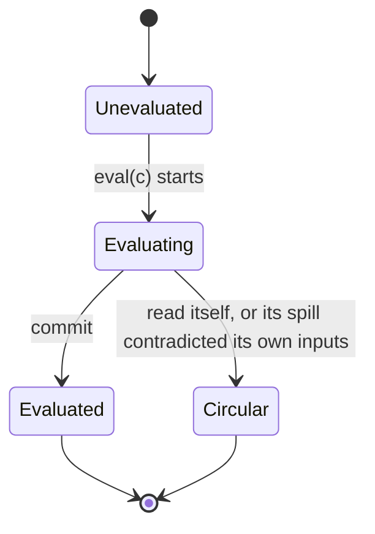
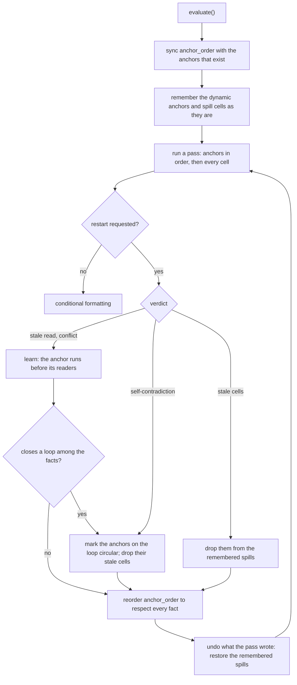
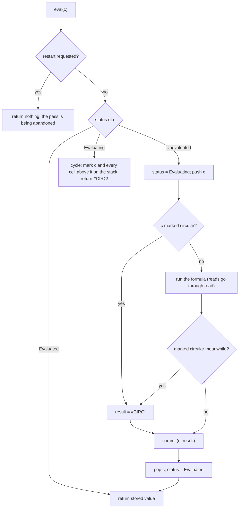
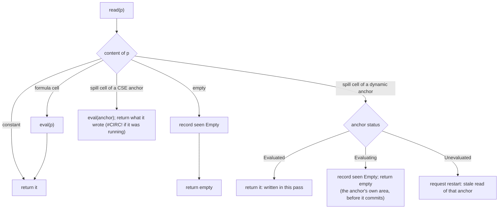
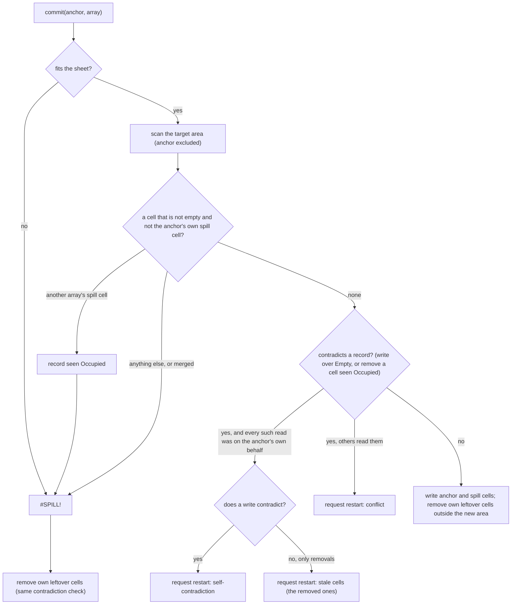

# Cold evaluation: a simplified algorithm

This document analyses how the evaluation algorithm of `evaluation.md` can be
reduced to a small number of ideas that anyone can hold in their head, for the
case of a *cold* evaluation: nothing has been evaluated yet, every formula has
to be computed. Warm (incremental) evaluation is a later step; the design here
is chosen so that it becomes that step's building block.

This is the design that is implemented; `evaluation.md` section 4 describes
the code, and section 7 below lists what the implementation changed.

1. What the specification is.
2. Where the current algorithm's complexity comes from.
3. The simplified algorithm, with diagrams.
4. Alternatives considered, with pros and cons.
5. A proof sketch, and what a Lean proof would look like.
6. Decisions taken.
7. What implementing it changes in the current code.

---

## 1. The specification

Before simplifying the algorithm it helps to say what "correctly evaluated"
means without reference to any algorithm.

A sheet `S` assigns to every position a content: a constant, a formula cell
with a stored value, an anchor with its area, a spill cell, or nothing. A
formula `f` at cell `c` is a function of the sheet: it *reads* some positions
and produces a result, a scalar or an array. Which positions it reads may
depend on what it finds (`IF`, `OFFSET`, `INDIRECT`).

**A sheet is consistent** when, for every formula cell `c` that does not hold
`#CIRC!`:

- its stored value is what its formula gives when evaluated against `S`
  itself, and
- if the formula gives an array, either the area below and right of `c` holds
  exactly that array as spill cells of `c`, or that area is blocked by other
  content and `c` holds `#SPILL!`.

Cold evaluation must turn any sheet into a consistent one, and report `#CIRC!`
on formulas whose value depends on itself. That is the whole contract. It is
also a usable test oracle: "evaluate everything, then check every formula
against the sheet it ended up in" is a few lines, and the naive "evaluate
everything again until nothing changes" computes the same fixed point on
cycle-free sheets.

The difficulty is entirely in one fact: an anchor writes positions other than
its own, and which positions is only known once it has run. A cell that read
one of those positions earlier has read the wrong thing.

---

## 2. Where the complexity comes from today

The algorithm in `evaluation.md` section 4 is correct and tested, but it has
grown seven mechanisms where the idea needs three:

| Mechanism | Why it exists | Can it go? |
|---|---|---|
| `readers` index with **generation tags** | Stale edges of a retracted evaluation must be ignored | Yes: if a cell drops its own old edges when it starts, edges are always exact and no tag is needed. This needs the forward direction of the graph, which warm evaluation needs anyway. |
| `retract_when_done` + **flag propagation to the parent** | A running cell that already read a position being written cannot be retracted; it finishes with a stale value, which its parent consumes | Yes: abort the running cell and re-run it *before* it returns. Its parent never sees a stale value, so nothing propagates. |
| **Rounds** loop after the sweep, with a bound | Retracted cells the sweep already passed must be redone | Becomes the driver loop itself: "while any cell is unevaluated, evaluate one". The bound stays as a safety net but is no longer a concept. |
| `circular` set with **path marking** in the write barrier | Every member of a cycle must show `#CIRC!` whichever path detected it | Partly. Scalar cycles keep the stack marking (one rule). For cycles through a spill area, in a cold evaluation, marking only the anchor is already deterministic and gives a stronger invariant (5.1). |
| Anchors-first heuristic | Fewer retractions | Keep as one line; it is not needed for correctness. |
| Forwarding through stale spill cells | Cells left by a previous evaluation must lead to their anchor | Keep: it is also how contention keeps history, and it is one sentence. |
| Return-what-was-written, clear-own-cells-first, blocking scan | Basic correctness of a single anchor | Keep, unchanged. |

Three ideas remain: a **dependency graph built while evaluating**, **demand-driven
recursion**, and **invalidation when an area is written** (with abort-and-retry
for cells still running). Everything else is either a consequence of those or a
heuristic.

---

## 3. The algorithm: ordered restart

### 3.1 The idea in one paragraph

A pass is the plain recursive algorithm of `evaluation.md` section 2, with
the dynamic anchors evaluated first in a remembered order. While it runs, the
pass records what each formula found at the positions it read: empty, or
occupied by another array's spill cell. When an anchor is about to spill and
the spill would contradict a record (write a position someone saw empty, or
remove a cell someone was blocked by), the pass is thrown away and started
again with that anchor before the cells that read it. Each restart is a fact
about the sheet, "this anchor runs before those readers"; the driver keeps
the facts of the evaluation and orders the anchors by them. The remembered
order survives across evaluations, so a sheet that needed restarts once
evaluates in a single pass afterwards. Cycles are what is left when the
facts contradict each other.

### 3.2 State

- `anchor_order`: the dynamic anchors, in evaluation order. Persistent.
  New anchors are appended in natural `(sheet, row, column)` order; anchors
  that are gone are dropped.
- Per pass: the status of each formula cell (`Evaluating`, `Evaluated`,
  absent = not yet), the evaluation stack, the set of circular cells, the
  `seen` map from position to what was found there, `Empty` and, separately,
  `Occupied` (both can hold: a leftover cell of the anchor being evaluated is
  read as empty on its behalf and then blocks an array evaluated inside it),
  each with the root of the recursion that read it, the `root` itself (the
  cell the driver is evaluating), and a `restart` request.
- The sheet itself. Spill cells from a previous evaluation stay where they
  are until their anchor runs.

A cell's life in one pass:

### 3.3 The driver

A restart has one of four reasons:

- **Stale read.** A spill cell of an anchor that has not run yet in this pass
  was read, on behalf of some root. Fact: the anchor runs before that root.
- **Conflict.** The anchor's spill contradicts what formulas evaluated on
  behalf of *other* roots read. Fact: the anchor runs before each of them.
- **Self-contradiction.** What the anchor writes contradicts only reads made
  on its own behalf: its inputs depend on its own output. The anchor is
  circular.
- **Stale cells.** Only the removal of the anchor's leftover cells
  contradicts, and only records made on its own behalf: an array evaluated
  for the anchor was blocked by cells the anchor no longer wants. Its inputs
  depended on its history, not on its output. The cells are dropped from the
  remembered spills, so no later pass restores them, and nothing is marked.

The driver keeps the facts of the evaluation and, after each restart,
repairs the order so that every fact holds: the anchor, and whatever the
facts place before it, move from behind the reader to just before it, in
their present order. A reader marked while an earlier reader of the same
restart was learned is skipped. Every root that read an anchor's area before
it ran sits before the anchor in the order, so the fact a restart brings is
one the order breaks, hence one not yet known. A fact that would close a loop among the facts is
not added: the anchors on that loop read each other's areas, no order can
serve them, and all of them are marked circular. A marked anchor stores
`#CIRC!`, runs no formula, and its stale cells are dropped from the
remembered spills when it is marked, so nothing of it is ever read or
contradicted again; its facts are discarded.

Every pass starts from the same sheet, because what an abandoned pass wrote
is undone, and a pass is therefore a function of the anchor order and of the
set of circular anchors. The only changes to the starting sheet are the
dropping of stale cells, at most once per cell.

### 3.4 `eval(c)`

Cycles closed by a read are marked on the stack: every cell from the one
that was read back to the top stores `#CIRC!` whatever its formula would have
made of the error, so the verdict does not depend on where the recursion
entered the loop. (A cell marked circular by the driver skips its formula.)

### 3.5 `read(p)`, on behalf of the cell on top of the stack

Outside a pass (conditional formatting at load time, formula helpers) there
is no driver to restart anything; a spill cell of an unevaluated anchor is
then read through its anchor, like a CSE cell.

### 3.6 `commit(anchor, array)`

A scalar or an error stored by a dynamic anchor also removes its leftover
spill cells, with the same check: removing a cell another array was blocked
by is a contradiction too. Another array's spill cell always blocks: the spill
that exists keeps its cells, as in Excel (`evaluation.md` 4.5).

### 3.7 What this removes and what it keeps

Removed, compared with the retraction design that preceded it: the
dependency graph in both directions, generation tags, abort flags, the
pending list and the run cap, the transitive stale walk with its parent
links, and the per-cell rules about what may be retracted while running.

Kept: the recursion, the `Evaluating` state and stack marking for value
cycles, the CSE rule, the blocking scan and the existing-spill rule,
return-what-was-written, and every editing path.

Added: `anchor_order`, which is Excel's calculation chain in embryo and the
first piece of state warm evaluation will need; and the `seen` map, one
entry per read, discarded at the end of the pass.

## 4. Alternatives considered

**Evaluate everything repeatedly until the sheet stops changing.** The
simplest statement possible, and exactly the specification's fixed point.
Pros: nothing to explain, trivially order-independent on cycle-free sheets.
Cons: at least two full passes always, and unbounded on long anchor chains;
volatile functions must be frozen for the duration (one `RAND()` value per
calculation); cycles show up as non-termination, and which cells to blame is
then a guess; no dependency graph comes out of it, so warm evaluation gets
nothing. Right as an oracle in tests, wrong as the engine.

**Excel's calculation chain.** No recursion: walk a list of formulas; when a
formula meets an uncalculated precedent, stop it, move the precedent in front,
restart. Pros: no recursion depth limit; the chain order persists across
recalculations and makes warm evaluation cheap. Cons: many partial
evaluations thrown away on a cold start; cycle detection needs a wait-for
graph. The ordered-restart algorithm of section 3 borrows the persistent
chain for the anchors only, keeps the recursion for everything else, and
restarts a whole pass rather than a single formula.

**Retraction inside the pass.** Record every read in a dependency graph and,
when a spill is written, invalidate what read the area, abort readers still
running, retract cycle members. This was implemented first and passed the
same tests. It is correct and never repeats work, but it needs a graph in
both directions, generation tags on edges, abort flags, a pending list, a
run cap and a page of rules about what may be retracted while running. It
replaced seven mechanisms with six. The ordered restart trades a little
repeated work on a cold sheet for a design that fits in a paragraph.

**Iterative semantics for cycles** (re-run until stable, `#CIRC!` only for
what never settles). Pros: no cycle detection machinery at all, just a cap
on re-runs; `A1 = B2+2`, `B1 = SEQUENCE(A1)` settles at `A1 = 4`. Cons: this
is not Excel, which reports every circular reference; which cells are blamed
depends on timing; and a settling cycle depends on the starting point, so
order independence is lost. Rejected.

**Static dependency graph from the parsed formulas, then topological
evaluation.** Pros: the textbook approach, and a real graph for warm
evaluation. Cons: the graph cannot be static. `INDIRECT`, `OFFSET`, `INDEX`,
defined names and above all spill areas add edges that exist only after
evaluation. Every "static" scheme ends up needing the dynamic discovery of
section 3 anyway; the two-phase ordering layer of the previous design was one
such scheme and it is what the retraction design replaced.

**Only forward propagation on value change** (invalidate direct readers when a
commit changes a value, rather than a transitive walk at spill time). Pros:
each step is local, and it is the natural rule for warm evaluation. Cons: a
spill cycle then shows up as an endless chain of changes instead of being
detected at the write, which pushes cycles back to the iterative semantics
above. The transitive walk at spill time is what makes "cycle" a structural
verdict. Both rules can coexist later: the walk for spills, change
propagation for edits.

---

## 5. Proof sketch

### 5.1 Invariants of a pass

- **(Exact records.)** Every read of an empty position, of an anchor's own
  area during its run, and every foreign spill cell an anchor was blocked by,
  is in `seen` before the pass can be contradicted by it: all of them go
  through `read` or the blocking scan, which record them.
- **(No stale value is ever read.)** A dynamic spill cell is only read as a
  value once its anchor has committed in this pass; otherwise the read either
  counts as empty (the anchor's own area, recorded) or restarts the pass. A
  CSE cell is always read through its anchor.
- **(A completed pass contradicts none of its records.)** A pass completes
  only if no commit found a contradiction, and commits are the only writes.

### 5.2 Partial correctness

Take a completed pass. A formula cell's stored value was computed from what
its reads returned. Constants and formula cells do not change during a pass.
A position read as empty was never written afterwards (no contradiction), so
it is empty in the final sheet. A spill cell read as a value was written by
its anchor's commit in this pass, and no later commit touched it (an anchor
only writes its own area, and another array's cell blocks). A blocked anchor
saw cells that were not removed afterwards (no contradiction), so it is still
blocked. Hence every non-`#CIRC!` cell equals its formula evaluated against
the final sheet, and every array occupies its area or is blocked: the sheet
is consistent in the sense of section 1.

### 5.3 Termination

Each pass starts from the same sheet (what an abandoned pass wrote is
undone), so a pass is a function of the order and of the circular set. Every
restart does one of three things.

- It adds a fact, "anchor `a` runs before reader `r`". The reader is a root
  the driver processed before reaching `a`, so `r` sits before `a` in the
  current order; the order respects every known fact; so the fact was not
  known. Facts are pairs of distinct anchors: at most `n(n-1)` such
  restarts.
- It marks anchors circular, when the fact would close a loop among the
  facts, or on a self-contradiction. The anchor of a restart is unmarked (a
  marked anchor runs no formula, writes nothing, and its stale cells were
  dropped when it was marked, so it is neither read stale nor contradicted),
  and so is every reader (a marked anchor makes no records). So each such
  restart marks at least one new anchor: at most `n` of them.
- It drops stale cells, at least one, and nothing ever puts one back: at most
  as many as there are stale cells.

Hence finitely many restarts, with a bound of about `n²`, and no cap is
needed. An earlier version of the driver moved the restarting anchor to the
front of the order and relied on an order repeating to detect loops; it
needed a budget of `n² + 2` restarts as a safety net, and a cycle-free sheet
of three tiers of anchors, each tier reading every spill cell of the next,
reached it with 29 anchors, marking innocent anchors circular
(`a_cycle_free_cascade_is_not_marked_circular`). Moving to the front put a
reader ahead of everything it read, and the cascade was cubic in the number
of anchors; with more tiers, exponential.

On a cycle-free sheet the facts learned are edges of the dependency order
among anchors, and the restarts are at most the number of such edges the
initial order breaks.

### 5.4 Order independence and cycle verdicts

On a cycle-free sheet without contention the consistent sheet is unique
(induction along the order above), and every anchor order reaches it, so the
result does not depend on the natural order, on the persisted order, or on
the restarts. Contention is history by design (`evaluation.md` 4.5): the
spill that exists keeps its cells.

Cycle verdicts are of three kinds, and each is a structural fact about the
sheet rather than about the order in which it was evaluated:

- a value cycle, closed by a read of a cell being evaluated: every cell on
  the loop is marked;
- a self-contradiction: the anchor's own inputs read its area and it writes
  there, whatever the order (the reads are on its behalf wherever it sits).
  When they were only blocked by its leftover cells, the cells are history:
  they are dropped and the verdict is the fresh sheet's;
- a loop of anchors reading each other's areas: detected when a fact would
  close a loop among the facts, and every anchor on that loop is marked.

One exception is documented and tested: when a cycle through a spill area
and contention for the same cells meet, whether the anchor is reported
circular or blocked depends on which array got there first, which is
history. `C3 = C5:C7` reads its own area and is circular on a fresh sheet; if
another array has already spilled into C5 it is simply blocked.

### 5.5 A Lean proof

The abstraction is the same as before: positions, contents, formulas as a
function of the sheet together with the set of positions they read. The
state machine is smaller than the retraction design's: a pass is a
deterministic function `(order, circular) → (sheet, restart?)`, and the
driver is a loop over it. Sections 5.2 and 5.3 are the two theorems; the
first is a statement about one pass, the second about the driver, and the
"orders are distinct between changes of the circular set" argument is a
pigeonhole lemma. It is done: `lean/IronCalcEval/`, about 6400 lines of
Lean 4 over Mathlib, both theorems proved with no `sorry`, and the termination
argument as it stands above (`lean/README.md` records what writing it
surfaced, including the sheet that reached the budget of an earlier driver). The property tests in `dynamic_evaluation/` are the same
statements run on random sheets against the real implementation.

## 6. Decisions taken

1. **Spill-cycle verdict: anchor only.** An anchor whose inputs read its own
   area stores `#CIRC!` and does not spill; the cells that read its area keep
   the values they computed with the area empty. Value cycles keep the stack
   marking. A loop of anchors reading each other's areas marks all of them.
2. **Termination is unconditional.** Every restart teaches the driver a
   fact about the order it did not know, or marks an anchor, or drops a
   stale cell; a fact that would close a loop marks the anchors of the loop.
   No budget.
3. **The anchors-first heuristic stays**, as the remembered `anchor_order`.
4. **Recursion stays for now.** Converting `eval` to an explicit stack is a
   mechanical, independent change to be done later.
5. **Cycle verdicts entangled with contention are history.** When an anchor
   is on a cycle through its own area and another array contends for those
   cells, it is reported circular on a fresh sheet and blocked once the other
   array has spilled. The property tests exempt such states from their
   equality checks and verify consistency instead.

## 7. What the implementation changed

The algorithm lives in `base/src/evaluation.rs`; `model.rs` keeps the writer,
`set_cells_with_result`, which now delegates a dynamic array to
`spill_dynamic_array` and asks the evaluation whether the spill contradicts a
read before writing anything.

- Gone from `model.rs`: the dependency graph in both directions, generation
  tags, abort flags, the pending list, the run cap, the forwarded set, the
  transitive stale walk with its parent links, and cycle-member retraction.
  About six hundred lines.
- `Evaluation` holds `anchor_order` (persistent), and per pass the cell
  states, the stack, the circular set, the `seen` records with their roots,
  and the restart request.
- `evaluate()` snapshots the dynamic anchors and spill cells, runs passes,
  undoes an abandoned pass, learns the facts a restart brings and reorders
  the anchors by them, drops stale cells from the snapshot, and marks
  circular anchors on self-contradiction or when a fact would close a loop.
- Tests: the whole `dynamic_evaluation` folder passes as it stood, with the
  anchor-only expectations of decision 1. `test_ordered_restart.rs` covers
  the mechanics: restart counts and the remembered order on chains, edits and
  row insertions, stale reads, a shrinking spill freeing a blocked array, the
  three cycle verdicts, and evaluation outside a pass. The consistency oracle
  of section 1 is `oracle.rs`, checked by both property tests on every state.
