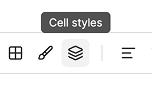
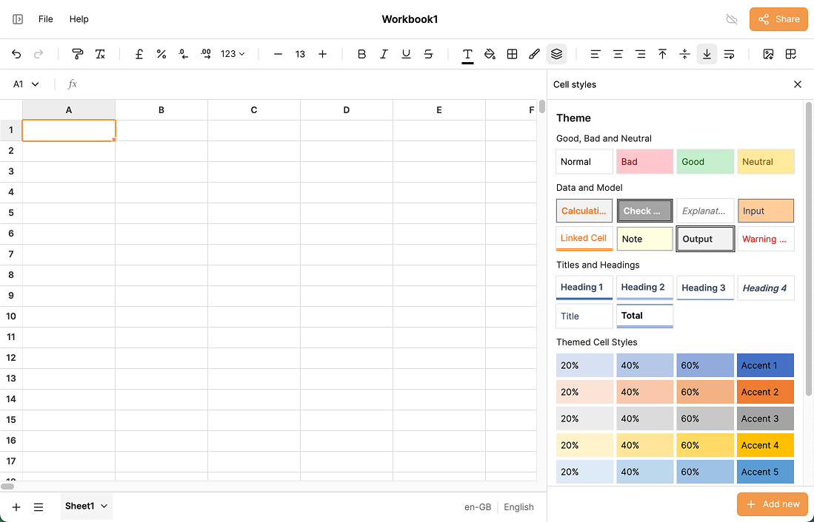
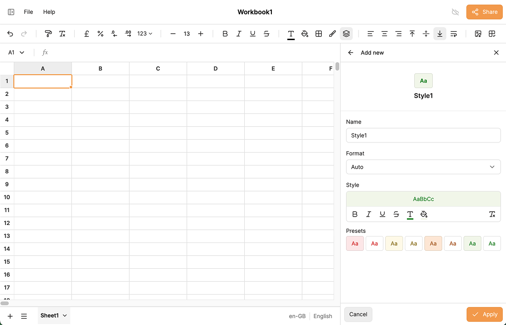
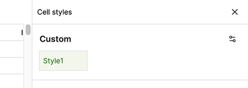
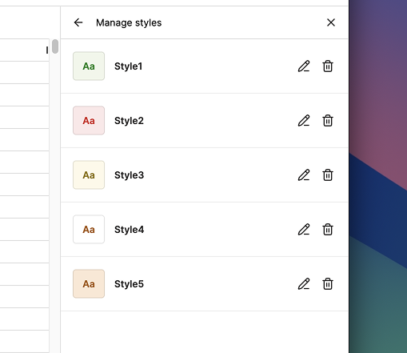

# Cell Styles

**Cell styles** are named formatting presets that let you apply a consistent look to cells without recreating the same combination of colors, fonts, and borders from scratch. IronCalc has a set of built-in styles, and you can create your own.

## Applying a Cell Style

1. Select the cell or cell range you want to format.
2. Click the **Cell Styles** icon in the toolbar.

A drawer opens on the right side of the screen, showing all available styles.

3. Click any preset to apply it immediately to your selection.

## Creating a Custom Style

1. At the bottom of the Cell Styles drawer, click **Add new**.
2. Enter a **name** for the style.
3. Choose the **format** and **style** options (font, colors, borders, etc.).
4. Click **Save**.

Your new style will appear at the top of the list and can be applied to any selection at any time.

## Managing Custom Styles

1. Click the **settings icon** in the top-right corner of the Cell Styles drawer.
2. A list of your custom styles appears.
3. Click the **pencil button** next to a style to edit it, or the **trashcan icon** to delete it.

## Excel Compatibility

Cell styles are preserved when importing workbooks from Excel, so your formatting carries over without any extra work.
