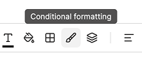
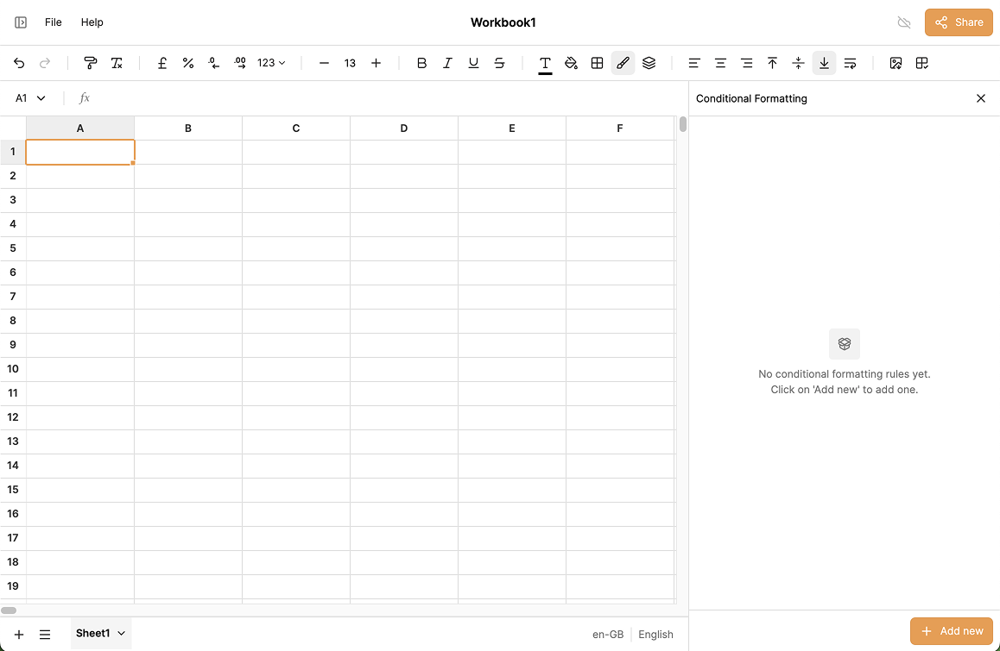
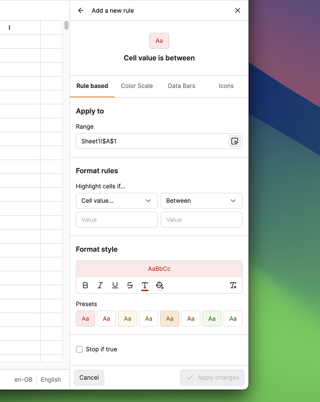
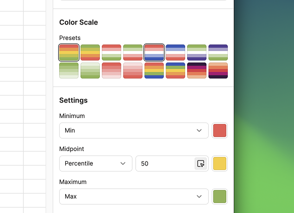
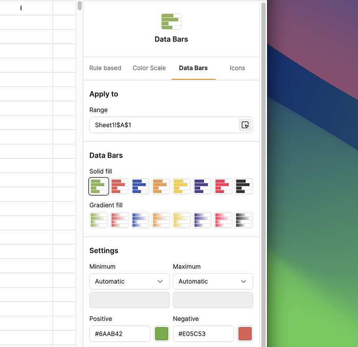
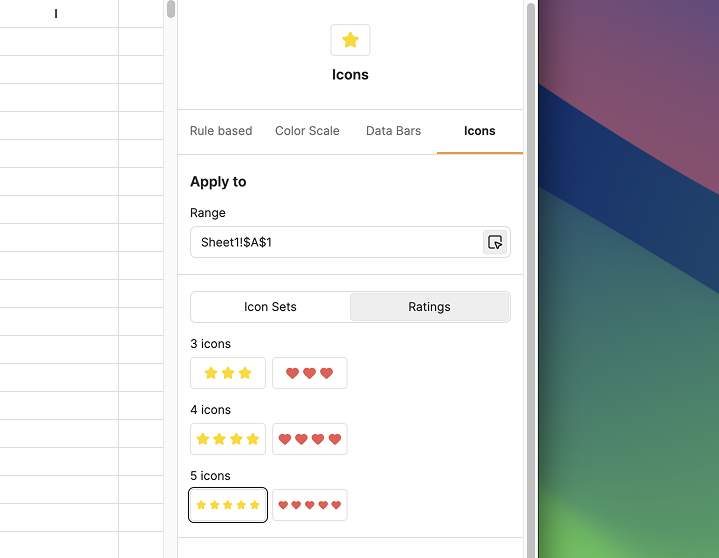

# Conditional Formatting

**Conditional formatting** automatically changes the appearance of cells based on their values or formulas, making it easy to highlight trends, outliers, and patterns at a glance.

## Opening the Conditional Formatting Drawer

Click the **Conditional Formatting** button in the toolbar.

A drawer opens on the right side of the screen. New workbooks start with no rules; click **Add new** to create your first one.

## Setting the Range

Every rule has an **Apply to** section at the top where you specify the cell range the rule applies to. You can type a range directly, or click **Use selected range** to fill it from your current selection.

## Rule Types

IronCalc supports four types of conditional formatting rules:

### 1. Rule Based

Format cells that match a condition. Choose a criteria type (**Cell value**, **Text**, **Date**, **Formula**, **Duplicate values**, and more) then refine it with an operator such as *between*, *greater than*, *equal to*, etc.

You can then pick a style to apply when the condition is met. Clicking one of the style presets will overwrite the custom style above it.

Enable **Stop if true** to prevent lower-priority rules from being evaluated when this rule matches.

### 2. Color Scale

Color scales apply a gradient fill to cells based on their relative values within the range. Choose from the built-in presets, or build a custom scale by setting the **minimum**, **midpoint**, and **maximum** values and assigning a color to each stop. To use a two-color scale instead of three, set the midpoint to **None**.

### 3. Data Bars

Data bars fill each cell with a bar whose length reflects the cell's value relative to the range, giving you an instant in-cell bar chart. IronCalc offers eight presets in solid or gradient styles.

In the settings you can:

- Leave the **minimum** and **maximum** as **Auto**, or set explicit numeric values.
- Edit the colors for both **positive** and **negative** bars independently.
- **Hide the cell value** so only the bar is shown.

### 4. Icons

Icons display a small symbol inside each cell based on its value. IronCalc provides two icon modes:

#### Icon Sets

Each cell receives one icon from a set of 2–5 variations. IronCalc includes several presets; in the settings you can change both the logic (the thresholds that determine which icon to show) and the icon and color for each stop.

#### Ratings

Ratings repeat an icon multiple times to represent a value, similar to a star-rating display. Sets can range from 3 to 5 repetitions, making them well suited for 1–5 scale data where a single icon per cell would lose information. Presets are available, and the logic, icon, and color are all editable.

For both modes, you can **hide the cell value** so only the icons are shown.

