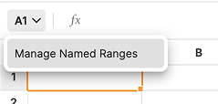
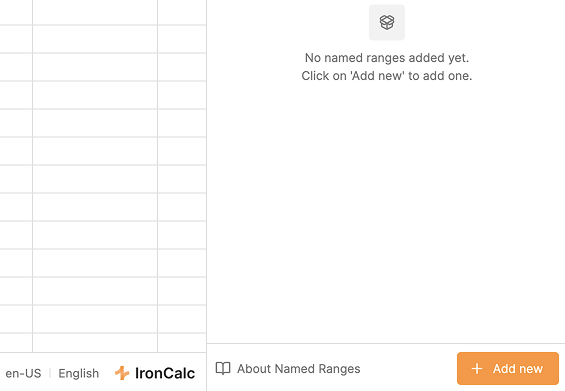
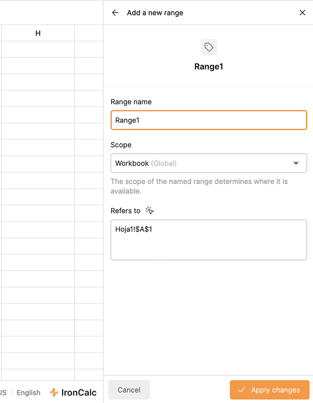

# Name Manager

The **Name Manager** lets you assign custom names to specific cells or ranges, making them easier to reference in formulas.

## How to Use It

1. Click the **Named Ranges** dropdown on the left side of the formula bar.

2. In the menu, click **Manage Named Ranges**. A drawer will open on the right side of the screen.
3. In the footer of the drawer, click **Add New**.

4. Enter a name to identify the range.
5. Set the scope:
   - **Global**: Applies to the entire workbook.
   - **Sheet-specific**: Applies only to the selected sheet.
6. The **Refers to** field shows the current selection. To change it, type a new reference or select a different cell/range and click the **cursor button** next to the label.
7. Click on **Apply changes** to save, or **X** to cancel.

## Managing Named Ranges

- Click the **Named Ranges** dropdown to see all existing named ranges. Clicking any of them will select that range in the canvas.
- From the menu, click **Manage Named Ranges** to open the drawer.
- In the drawer, click any named range to select it on the canvas.
- To **edit** a range, click the **pencil button**.
- To **delete** a range, click the **trashcan icon**.