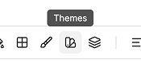
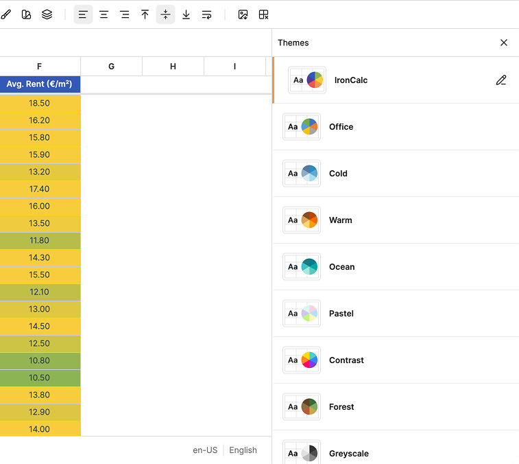
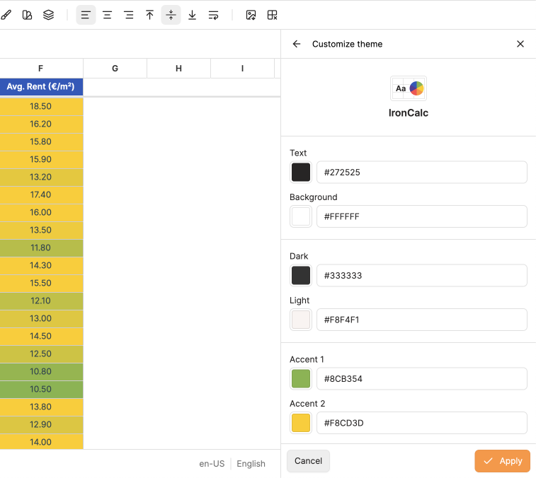

# Themes

A **theme** is a coordinated set of colors for text, background, accents, and hyperlinks that defines the overall look of your workbook. Theme colors are also available wherever you pick a color, such as font, fill, borders, or conditional formatting, so changing the theme updates everything that uses a theme color.

## How to Use It

1. Click the **Themes** icon in the toolbar.

2. In the menu, click any theme to apply it to the workbook. The small swatches next to each name preview its accent colors.
3. To create or edit a custom theme, click **Manage Themes**. A drawer will open on the right side of the screen.

4. In the drawer, click a theme to select and apply it.
5. With a theme selected, click the **pencil button** to customize it.

6. Adjust the colors:
   - **Text** and **Background**: the main colors used for cell text and the sheet background.
   - **Dark** and **Light**: secondary colors used by some elements.
   - **Accent 1 to 6**: used in styles, charts, and conditional formatting palettes.
   - **Hyperlink** and **Followed hyperlink**: colors for unvisited and visited hyperlinks.
7. For each color, click the **swatch** to open the color picker, or type a hex value directly in the input.
8. Click **Apply** to save your changes, or **Cancel** to discard them.

Customizing a theme creates a new entry named **Custom** at the top of the list. Only one custom theme can exist at a time, so applying changes again overwrites it.

## Compatibility

If you import a file that uses a theme not in the list, IronCalc keeps that theme and adds it to the **Themes** menu and drawer. You can leave the imported theme as is, or switch to one of IronCalc's built-in themes at any time.

Exported files work the same way: the theme is preserved in the file, so it opens with the same colors in other platforms. If the file is later edited there, that platform may overwrite the theme with its own.
