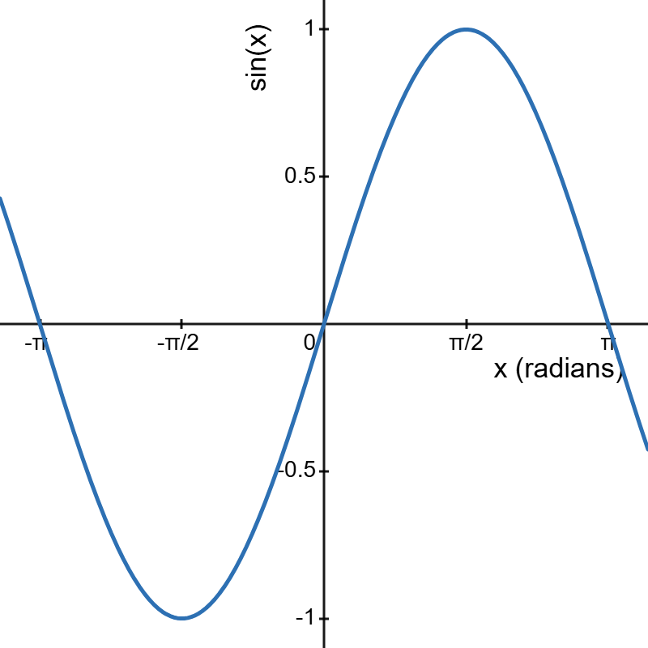

# SIN function
## Overview
SIN is a function of the Math and Trigonometry category that calculates the trigonometric sine of an angle, returning a value in the range [-1, +1].
## Usage
### Syntax
**SIN(number)**
### Argument descriptions
* *number*. The value of the angle, expressed in radians.
To convert between degrees and radians, use the relation below. Alternatively, use the [DEGREES](./DEGREES) or [RADIANS](./RADIANS) functions.
$$
1~\:~degree = \dfrac{\pi}{180} = 0.01745329252~radians
$$
### Additional guidance

<!--@include: ../markdown-snippets/error-type-details.md-->

## Details
* The SIN function utilizes the *sin()* method provided by the Rust language for its "[f32](https://doc.rust-lang.org/std/primitive.f32.html#method.sin)" and "[f64](https://doc.rust-lang.org/std/primitive.f64.html#method.sin)" floating types.
* The figure below illustrates the output of the SIN function for values of *x* in the range -π to +π.

## Examples
[See this example in IronCalc](https://app.ironcalc.com/?example=SIN).

## Links
* For more information about trigonometric sine, visit Wikipedia's [Sine and cosine](https://en.wikipedia.org/wiki/Sine_and_cosine) page.
* See also IronCalc's [ASIN](./ASIN), [COS](./COS) and [TAN](./TAN) functions.
* Visit Microsoft Excel's [SIN function](https://support.microsoft.com/en-gb/office/sin-function-cf0e3432-8b9e-483c-bc55-a76651c95602) page.
* Both [Google Sheets](https://support.google.com/docs/answer/3093447) and [LibreOffice Calc](https://wiki.documentfoundation.org/Documentation/Calc_Functions/SIN) provide versions of the SIN function.