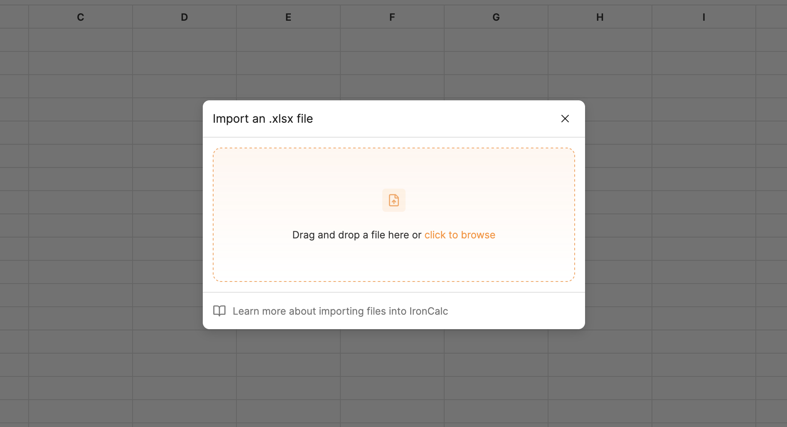

# Importing Files

IronCalc supports importing **Excel files (`.xlsx`)**. You can open existing spreadsheets and continue working on them directly in IronCalc.

## How to Import Files

1. In the top-left corner of the screen, click on **File** and then **Import**. This will open a dialog.

2. From the dialog, upload your file using one of the following methods:
   - **Drag and Drop**: Drag your `.xlsx` file and drop it onto the upload area.
   - **Click to Browse**: Click on the orange link and select a file from your device.

::: info
The maximum file size allowed is **10 MB**.
:::
