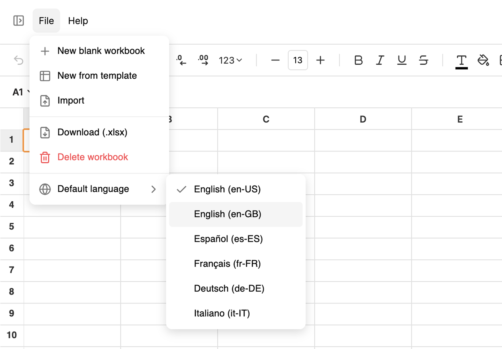

# Language Selector

IronCalc can be used in multiple languages. Switching the language affects not only the interface, but also the **engine**—formulas and error messages will use the selected language.

::: info
Currently, only **English**, **Spanish**, **French**, **German**, and **Italian** are supported. If you'd like us to add a specific language, let us know on [Discord](https://discord.com/invite/zZYWfh3RHJ) or start a [Discussion](https://github.com/ironcalc/IronCalc/discussions) in our GitHub repository.
:::

## How Languages Work in IronCalc

IronCalc will try to match your browser's language and locale when possible. If your language is not supported, it will default to **English (en-US)**.

If you change the language, this preference is stored in your browser's **local storage**, so every time you access IronCalc, your setting will be remembered.

Switching the language affects **all workbooks**, updating both the interface and engine language. The [locale](/features/regional-settings) will also change, unless it has been manually set for a specific workbook.

## How to Change the Language

1. In the top-left corner, click on **File**.
2. In the menu that opens, hover over **Default Language**.
3. Click on the language you want to use.

The language changes instantly. Any formulas you have will update to use the new language. The rest of the interface—menus, buttons, and tooltips will be translated as well. 

