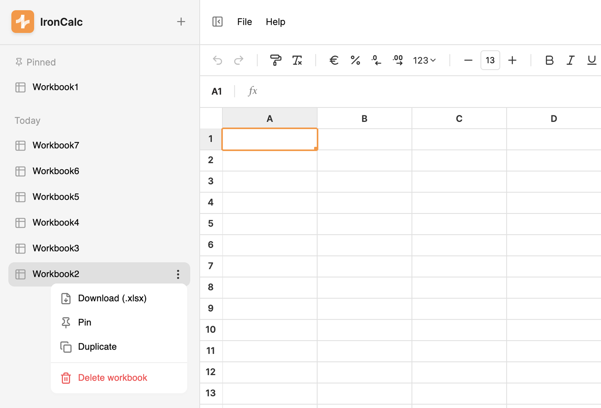

# Managing Workbooks

All your workbooks can be accessed from the **Workbook Sidebar**. To open it, click the menu button in the top-left corner of the window.

## How to Add a New Workbook

1. Click the **plus icon** at the top of the sidebar.
   - This will instantly create a new workbook. Workbooks are ordered by date (newest on top).
   - You can also add a workbook from the **File** menu.

Workbooks can also be added by duplicating existing ones. Click the **ellipsis button** (⋯) next to the workbook name, then click **Duplicate**.

## How to Delete a Workbook

1. Click the **ellipsis button** (⋯) next to the workbook name, then click **Delete**.
2. A confirmation dialog will appear. Click **Accept** to confirm deletion.

## How to Pin a Workbook

1. Click the **ellipsis button** (⋯) next to the workbook name, then click **Pin**.

**Pinned workbooks** appear at the top of the sidebar, even above newly created workbooks. To unpin, click the **ellipsis button** again and select **Unpin**.