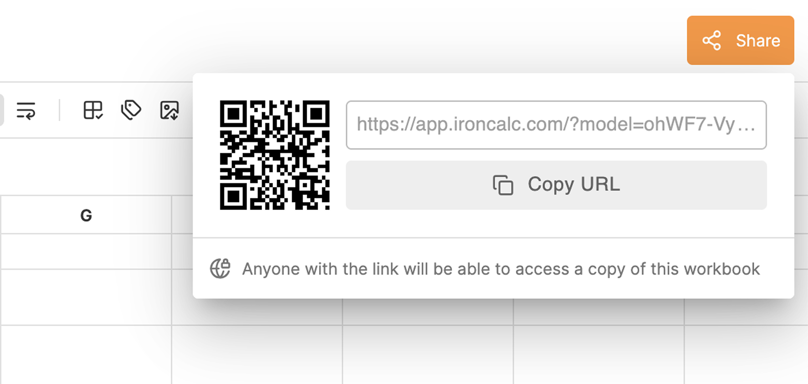

# Sharing Files

IronCalc allows you to share your spreadsheets with others via a URL or QR code.

## How Sharing Works

- **Snapshot of the original sheet**:  
   The shared URL opens a **snapshot** of the sheet as it was when you clicked **Share**. Any changes made to the original sheet after sharing **will not** be reflected in the shared version.

- **Changes in the shared version**:  
   Any edits made to the shared sheet **will not** affect or overwrite the original. Each shared link is independent.

## How to Share a File

1. **Click the Share button**:  
   In the top-right corner of the screen, click the **Share** button. This will open a small dialog.

   

2. **Copy the URL**:  
   After clicking, the button, the sharing URL will be automatically copied to your clipboard. You can also scan the **QR code** with your phone for quick access.

3. **Share the URL**:  
   Paste the URL into a message, email, or browser to share or open the sheet.