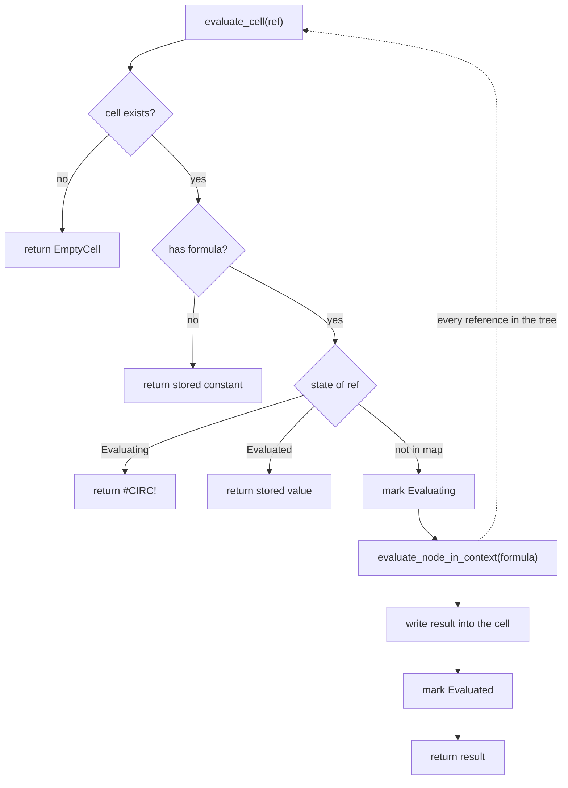
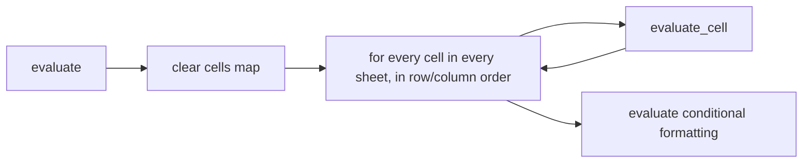
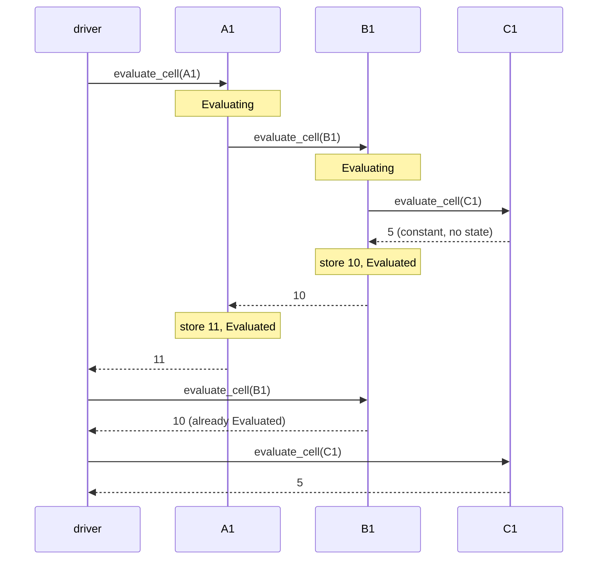
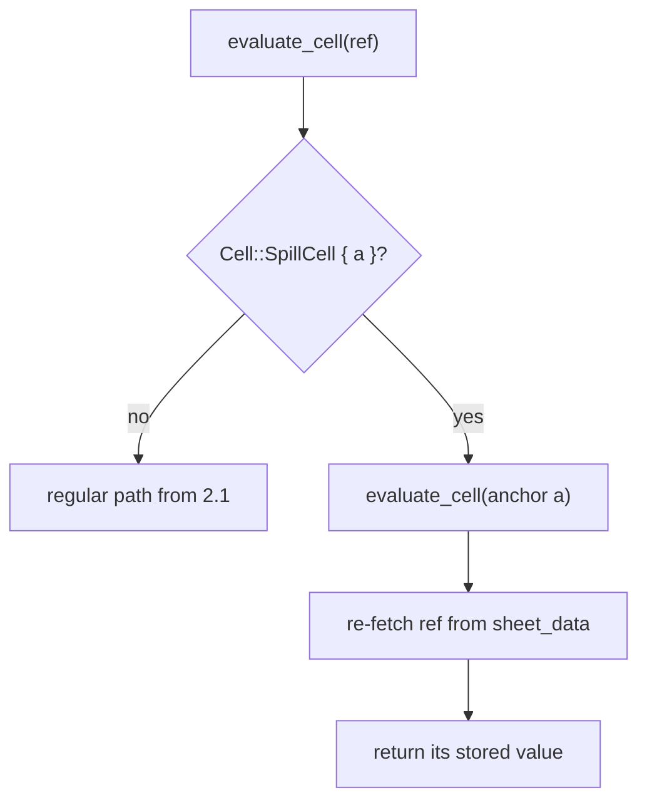
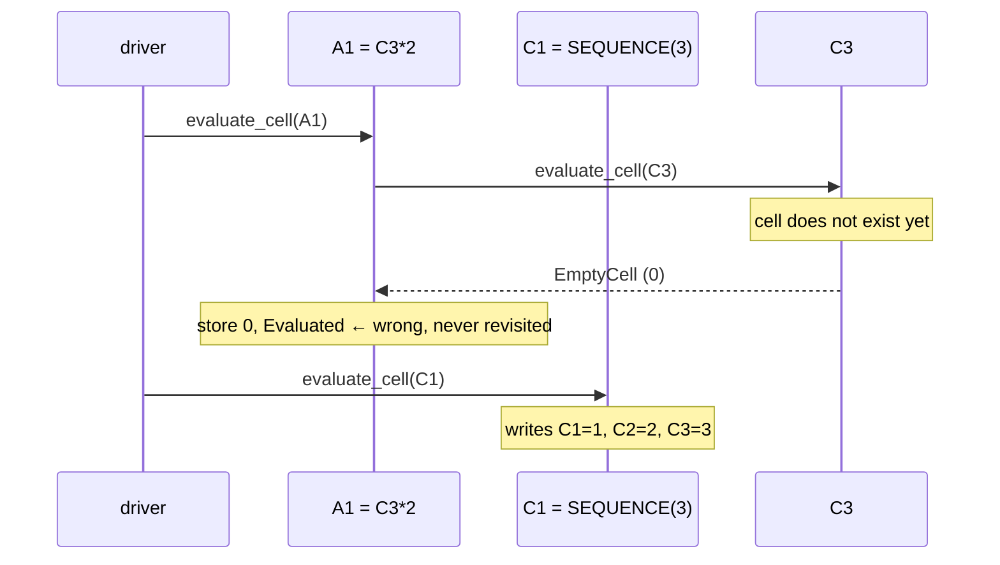
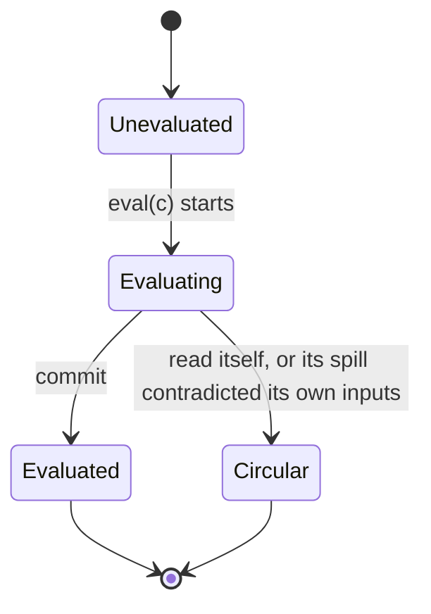
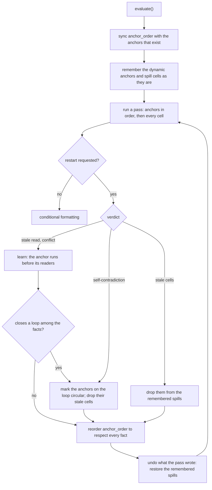
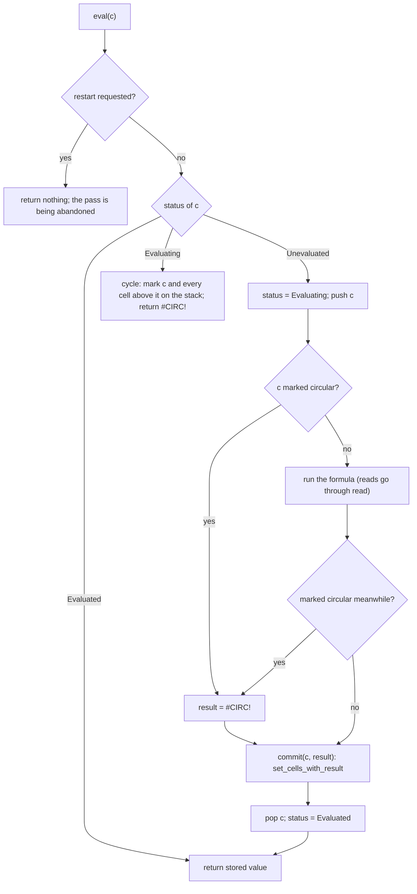
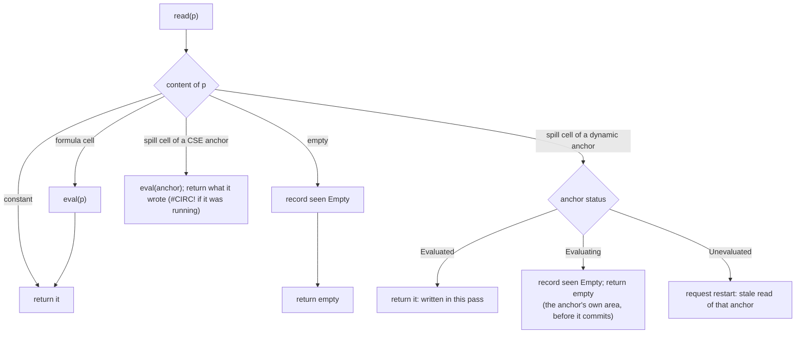
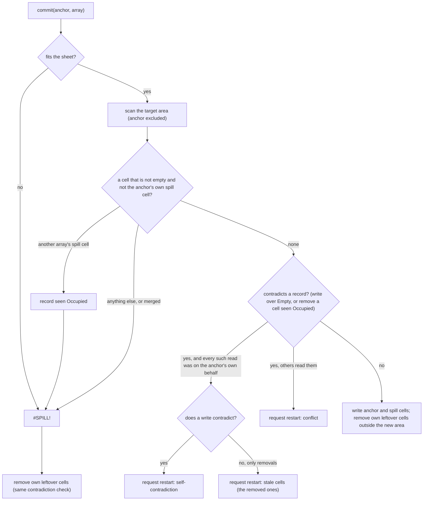

# The IronCalc evaluation algorithm

This document describes how IronCalc evaluates a workbook, as implemented in
`base/src/model.rs`. It is organised in five parts:

1. The data structures the algorithm works on.
2. The simple top-down recursive algorithm and its adaptation for CSE array
   formulas. These two together are the "core" of the engine.
3. Why the core alone is not enough for dynamic arrays.
4. The algorithm in use: the core plus a record of what each pass read, and
   a restart of the pass whenever a spill would contradict that record.
5. Semantic decisions, known limitations, and where the tests and the code
   live.

---

## 1. Data structures

### Cells

A worksheet stores cells in `sheet_data: HashMap<row, HashMap<column, Cell>>`.
The relevant variants of `Cell` (`base/src/types.rs`) are:

| Variant | Fields | Meaning |
|---|---|---|
| `EmptyCell`, `NumberCell`, `BooleanCell`, `SharedString`, `ErrorCell` | value + style | Constants. Never "evaluated"; their value is read directly. |
| `CellFormula { f, s, v }` | formula index, style, `FormulaValue` | A regular scalar formula. |
| `ArrayFormula { f, s, r, kind, v }` | + `r = (width, height)`, `kind = Cse \| Dynamic` | The *anchor* of an array formula. `r` is the area it currently occupies. |
| `SpillCell { s, a, v }` | style, `a = (row, column)` of the anchor, `SpillValue` | A cell whose value was written by the anchor at `a`. It has no formula of its own. |

`FormulaValue` is `Unevaluated | Number | Text | Boolean | Error{ei, o, m}`.
`Unevaluated` is the state of a freshly entered formula. Reading it produces an
`#ERROR!` "Unevaluated formula", which is how one notices a bug in the ordering.

Formulas are stored per sheet as parsed trees in
`Model::parsed_formulas[sheet][f] = (Node, StaticResult)`. The `StaticResult`
comes from `run_static_analysis_on_node` (`expressions/parser/static_analysis.rs`)
and says whether the formula is known to produce a `Scalar`, an `Array(rows, cols)`,
a `Range(rows, cols)` or `Unknown`. It is computed at parse time and its only use
today is at input time: `set_cell_with_formula` creates a
`CellFormula` when the result is `Scalar`, and an `ArrayFormula { kind: Dynamic, r: (1, 1) }`
otherwise. Formulas imported from xlsx are classified by the file instead
(`t="array"` with the `cm` attribute becomes `Dynamic`, without it `Cse`).

### Evaluation bookkeeping on `Model`

```rust
pub(crate) enum CellState { Evaluated, Evaluating }

pub struct Model {
    /// Formula cells that have been touched in this evaluation, and their state.
    /// Absent from the map == not evaluated yet.
    cells: HashMap<(sheet, row, column), CellState>,
    ...
}
```

This is the only state the core algorithm of section 2 needs; the algorithm in
use adds the remembered anchor order and a per-pass record of reads, listed
in 4.1, all grouped in `Model::evaluation`. Everything is cleared at the
start of each evaluation. Note that the stored values in the cells are *not*
reset to `Unevaluated`: "mark everything as unevaluated" is implemented by
clearing the `cells` map. A value stored in a formula cell is only trusted
when the map says `Evaluated`.

### Evaluation results

The evaluator works on `CalcResult`:

```
Number | String | Boolean | EmptyCell | EmptyArg | Error { error, origin, message }
Range { left, right }      // a reference, not yet dereferenced
Array(Vec<Vec<ArrayNode>>) // an in-memory array
Lambda(id)
```

A `Range` is *lazy*: producing it does not evaluate any cell. Whoever consumes
it (a function iterating over it, an implicit intersection, or `evaluate_range`
when a whole range has to become an array) calls `evaluate_cell` for each cell
it actually needs.

---

## 2. The core algorithm

### 2.1 The simple recursive algorithm

The engine has no dependency graph and no dirty tracking. Every call to
`Model::evaluate()` recomputes every formula in the workbook. The core idea is:

1. Forget every previous evaluation state (clear `cells`).
2. Walk every cell of every sheet in `(sheet, row, column)` order and call
   `evaluate_cell` on it. The order does not matter for correctness of scalar
   formulas; it only changes which cell triggers the evaluation of which.
3. `evaluate_cell` marks the cell `Evaluating`, evaluates its formula tree, stores
   the result in the cell and marks it `Evaluated`.
4. While evaluating the tree, every reference to another cell calls
   `evaluate_cell` on that cell recursively. So the walk is depth-first over the
   references a formula *actually* uses (an `IF` only evaluates the branch it
   takes).
5. If the referenced cell is already `Evaluated`, its stored value is returned.
6. If the referenced cell is currently `Evaluating`, we have closed a cycle and
   `#CIRC!` is returned.
7. Constants are returned directly and are never marked.



The outer driver is trivial:



Worked example, sheet with `A1 = B1 + 1`, `B1 = C1 * 2`, `C1 = 5`:



Circular references. With `A1 = B6`, `A2 = A1 + 1`, `A3 = A2 + 1`, `A4 = A3 + 5`,
`B6 = A4 * 7` the driver starts at `A1`, recurses `A1 → B6 → A4 → A3 → A2 → A1`,
finds `A1` in state `Evaluating` and returns `#CIRC!` to `A2`. The error then
propagates back up the recursion, so every cell in the cycle ends up as
`#CIRC!`. There is no iterative calculation; a cycle is always an error. Because
detection is dynamic, `=IF(FALSE, A1, 0)` in `A1` is not a cycle.

### 2.2 How references are consumed

`evaluate_node_in_context` (`model.rs`) is the tree walker. The reference nodes
behave as follows:

- `ReferenceKind` (a single cell such as `B3`): immediately calls
  `evaluate_cell`.
- `RangeKind` (`B1:B5`): returns a lazy `CalcResult::Range`. Nothing is
  evaluated yet.
- Functions receive `Range` results and iterate over them calling
  `evaluate_cell` per cell (see `fn_min`, `fn_sum`, database functions, lookup
  functions, and so on). Functions that need the whole thing as an array call
  `evaluate_range`, which does the same in a loop.
- `evaluate_node_with_reference` is the variant used where a *reference* is
  wanted rather than a value (the child of `@`, of `#`, of `OpRangeKind`
  `A1:INDEX(...)`, and of functions such as `OFFSET` or `INDEX` that return
  references). It returns `Range` for both single cells and ranges.
- `ImplicitIntersection` (`@`) intersects the range with the current cell's row
  or column and then evaluates that one cell. The scalar casts in `cast.rs`
  do the same at runtime for a `Range` that reaches them (a reference returned
  by `INDIRECT`, `OFFSET` or `INDEX` inside a scalar argument): a single cell
  gives its value, a larger range intersects, `#VALUE!` when there is no
  intersection, and a 1x1 array unwraps to its element.
- `SpillRangeOperator` (`C1#`) evaluates the anchor `C1` first, then reads its
  `r` field and returns the range `C1:(C1 + r)`.
- `DefinedNameKind` for a defined name pointing to a cell calls `evaluate_cell`;
  for a range returns a lazy `Range`.

The result of the tree walk goes through `set_cells_with_result`, which converts
`CalcResult` into a `FormulaValue` and writes the new `Cell` back. A `Range` that
reaches the top of a scalar formula is first turned into an array with
`evaluate_range` (or into the single cell's value when it is 1x1).

### 2.3 Adaptation for CSE array formulas

A CSE formula (`{=B1:B3*2}` entered over `A1:A3`) has a *fixed* target range
chosen by the user before the formula is ever evaluated. It is stored as:

- `A1 = ArrayFormula { kind: Cse, r: (1, 3), v }` — the anchor.
- `A2`, `A3` = `SpillCell { a: (1, 1), v }` — created at input time by
  `set_user_array_formula` (and by the xlsx importer), so they exist before
  the first evaluation.

The adaptation to the recursive algorithm is one rule:

> When the value of a `SpillCell` is requested, evaluate its anchor first, then
> read the value the anchor wrote into the spill cell.



And on the anchor side, when the formula result is an `Array`,
`set_cells_with_result` writes the anchor value into `A1` and one `SpillCell`
per position in `r` (missing array positions become `#VALUE!`, and a scalar
result is broadcast to the whole range). The anchor's own `evaluate_cell`
returns what was written, so that whoever asked for `A1` sees the same thing
that later readers will find in the sheet.

This works because the two things the recursion needs are known *before*
evaluation starts:

1. which cells belong to the array (they already exist as `SpillCell`s with the
   right anchor), and
2. that no other formula can write into them (a CSE range cannot be partially
   overwritten; `prepare_cell_for_user_input` refuses edits inside one, and
   `set_user_array_formula` refuses an area that overlaps one).

So a request for `A3` from anywhere, in any order, is redirected to `A1`, and
the usual `Evaluating` / `Evaluated` bookkeeping on `A1` gives the same
guarantees as for a scalar cell. Cycle detection through a CSE array also
works: if evaluating `A1` requests `A3`, the redirect asks for `A1` again,
finds it `Evaluating`, and the `#CIRC!` is returned to the reader instead of
the stale value the spill cell holds.

---

## 3. Why the core alone is not enough for dynamic arrays

A dynamic array formula (`C1 = SEQUENCE(3)`, or `C1 = D1:D3`) differs from a
CSE formula in exactly the point the adaptation relied on: **the spill area is a
result of the evaluation, not an input to it**. At input time the anchor is
stored as `ArrayFormula { kind: Dynamic, r: (1, 1) }` and the cells `C2`, `C3`
are whatever they were before (usually absent). Nothing in the sheet says
that `C2` and `C3` will be written by `C1`.

The recursion therefore has no way to redirect a request for `C2` to `C1`:



The problem is symmetric in time: it appears whenever a reader is evaluated
before the writer. Concretely it shows up in three forms.

1. **A regular cell reads a not-yet-spilled position.** `A1 = C3*2` above. `A1`
   sees an empty cell, stores `0` and is marked `Evaluated`; the later spill
   into `C3` does not invalidate it.
2. **A dynamic array reads another dynamic array's spill.** `B1 = C1:C3`,
   `C1 = D1:D3`. `B1` is evaluated first (column B before column C), copies
   three empties, and only then does `C1` spill.
3. **Stale spill from a previous evaluation.** On the *second* `evaluate()` the
   cells `C2`, `C3` do exist as `SpillCell { a: C1 }`, so the CSE redirect
   kicks in and the result is right. But if the shape of the spill changed
   (`SEQUENCE(A1)` with a new `A1`), positions that were not part of the old
   spill are still unknown, and positions that are no longer part of it have to
   be cleared. A workbook that is "wrong after the first evaluation and right
   after the second" is the typical symptom.

There are two further consequences of "the area is unknown until evaluated":

- **Blocking.** A dynamic array must not overwrite a non-empty cell; it produces
  `#SPILL!` instead. Whether a position is empty depends on whether *other*
  dynamic arrays have already spilled there, so two arrays contending for the
  same cells need a rule (4.5).
- **The spill range operator.** `=SUM(C1#)` depends on the shape of `C1`,
  which is only known once `C1` has run in this pass; reading the stored `r`
  without evaluating `C1` first gives `(1, 1)` on fresh input, or a stale area.

In graph terms: for scalar and CSE formulas the dependency edges of a cell can
be read off its formula and the sheet, so a depth-first walk finds the right
order on its own. For dynamic arrays some edges (anchor → each position in its
spill area, and therefore anchor → every reader of those positions) only exist
after the anchor has run. A pure demand-driven recursion cannot discover an
edge that does not exist yet, and choosing a good order up front is not
possible either: whether a formula reads a position at all can depend on
values (`IF`, `OFFSET`, `INDIRECT`), so the reader set is only known by
running it.

---

## 4. The algorithm in use

The driver and the per-cell recursion are the ones of section 2, with one
addition: **a pass records what formulas found at the positions they read,
and an anchor whose spill would contradict a record makes the pass start
again with that anchor first.** The order of the anchors is remembered, so a
sheet that needed restarts once evaluates in a single pass afterwards.
`cold-evaluation.md` gives the reasoning, the alternatives, and a proof
sketch; `base/src/evaluation.rs` is the code, and it is short.

### 4.1 State

| Field on `Model::evaluation` | Meaning |
|---|---|
| `anchor_order: Vec<CellReferenceIndex>` | The dynamic anchors in evaluation order. Persists across evaluations; new anchors are appended in natural order, gone ones dropped. |
| `cells: HashMap<CellKey, CellState>` | As before: `Evaluating` / `Evaluated`, absent = not evaluated in this pass. |
| `stack: Vec<CellReferenceIndex>` | Cells being evaluated, innermost last. |
| `root: Option<CellReferenceIndex>` | The cell the driver is evaluating, on whose behalf every read is recorded. |
| `circular: HashSet<CellKey>` | Cells that store `#CIRC!` whatever their formula does: marked on the stack when a read closes a loop, or by the driver (4.4). |
| `seen: HashMap<CellKey, (Seen, root)>` | What the pass found at each position it read, `Empty` or `Occupied`, and the root of the recursion that read it. |
| `restart: Option<Restart>` | Set when the pass must be abandoned: a stale read, a conflict, a self-contradiction, or stale cells to drop (4.3). |
| `in_pass`, `restarts_in_last_evaluation` | Whether a pass is running; a counter for tests. |

Everything but `anchor_order` is reset at the start of each pass.

A cell's life in one pass:



### 4.2 `evaluate()`



A stale read or a conflict is a fact about the sheet: the anchor runs before
the roots that read its area too early. The driver keeps the facts of the
evaluation (`RestartLog`) and after each restart repairs the order so that
all of them hold: the anchor, and whatever the facts place before it, move
from behind the reader to just before it. Every such restart
adds a fact the order broke, hence one not yet known, so there are at most
`n(n-1)` of them, `n` the number of anchors; a fact that would close a loop
among the facts marks the anchors on the loop instead, at most `n` times;
stale cells are dropped at most once each. That is the whole termination
argument (`cold-evaluation.md` 5.3), and there is no cap on restarts.

Every pass starts from the same sheet, because what an abandoned pass wrote
is undone. A pass is therefore a function of the anchor order and of the set
of circular anchors, which is what makes the driver's verdicts sound (4.4).
The only changes to that sheet within an evaluation are the dropping of
stale cells (4.3): an anchor's own when it gives them up, a marked anchor's
when it is marked.

### 4.3 A pass: `eval`, `read` and `commit`







Points the diagrams compress:

- **A spill cell is never read as a stale value.** Its anchor either committed
  in this pass (fresh), is running (its own area counts as empty until it
  commits, and the read is recorded), or has not run (restart with it first).
  CSE cells forward to their anchor as in 2.3. Outside a pass, where there is
  no driver, a dynamic spill cell forwards like a CSE cell.
- **Reads are recorded with the root of the recursion**, the cell the driver
  was evaluating. That is how `commit` tells a self-contradiction (every
  contradicted read was made on the anchor's own behalf, so its inputs depend
  on its output) from a conflict (something else read the area first).
- **Stale cells are history, not output.** When the only contradicted
  records are of leftover cells the anchor is removing, and every one of
  them was made on the anchor's own behalf, an array evaluated for the
  anchor was blocked by cells the anchor no longer wants. The anchor's inputs
  depended on its history, not on what it produces, so it is not circular:
  the cells are dropped for the rest of the evaluation and the pass restarts.
  A write that contradicts an own read is a self-contradiction as before.
- **A dynamic anchor reconciles its cells at commit**: it rewrites the ones in
  its new area and removes its leftovers outside it, with the same
  contradiction check, since removing a cell another array was blocked by
  changes that array's outcome. Cells with other content are never touched.
- **The anchor returns what was written**, not what it computed: the first
  element of a spilled array, the coerced value of a 1x1 array, or the error
  the result was turned into (`#SPILL!`, `#CIRC!`, `#CALC!`). A dependent
  evaluated in this pass therefore observes the same value it would read from
  the sheet later. Every error branch stores the error like a scalar
  formula, with `r = (1, 1)`; the anchor keeps its `Dynamic` kind and tries
  to spill again on the next evaluation.
- **Another array's spill cell always blocks**: the spill that exists keeps
  its cells (4.5).

### 4.4 Cycles

Three verdicts, each a structural fact about the sheet:

- **A value cycle**, closed by a read of a cell in state `Evaluating`: every
  cell on the stack from the one that was read to the top is marked, and
  stores `#CIRC!` whatever its formula would have made of the error. This is
  LibreOffice's behaviour; Excel shows zeros and a warning. It is what makes
  the verdict independent of where the recursion entered the loop.
- **A self-contradiction**: the anchor's own inputs read its area, and the
  anchor writes there. The anchor alone is marked; it stores `#CIRC!` and
  does not spill, and the cells that read its area keep the values they
  computed with the area empty, which is what the final sheet holds. Example:
  `A1 = B2+2`, `B1 = SEQUENCE(A1)` gives `B1 = #CIRC!` and `A1 = 2`. An
  anchor whose inputs were blocked only by its own stale cells is not
  circular (4.3): the cells go, and the verdict is the fresh sheet's.
- **A loop of anchors reading each other's areas**: no order works, the
  facts the restarts learn close a loop, and every anchor on that loop is
  marked. `A1 = B2:B3`, `B1 = A2:A3` gives `#CIRC!` in both.

Marks made by the driver survive restarts within one evaluation; every mark
is forgotten at the next `evaluate()`, so a cycle that was edited away is
gone at once.

### 4.5 Contention between dynamic arrays

When two dynamic arrays want the same cell, the spill that is already there
keeps it and the other anchor gets `#SPILL!` until the first one goes away.
This is Excel's rule, and it is what a file saved by Excel encodes, since the
importer recreates the spill cells it contains. On a fresh sheet where neither
has spilled yet, the first anchor to evaluate wins, which with the
anchors-first pass is the earlier one in `(row, column)` order.

The consequence is that the state of a sheet is its contents *plus* its
existing spill cells, not its contents alone. The property tests account for
that: order independence holds on fresh sheets, and the history test only
compares against a fresh model when no `#SPILL!` is present.

Contention plus a dependency can produce two self-consistent states for one
sheet. `C3 = D2:D4`, `D3 = D4+1`, `B4 = SEQUENCE(1,3)`: C3 and B4 both want C4,
and C3 reads D3, which reads B4's spill cell D4. If B4 spilled first, it keeps
C4 and C3 is `#SPILL!`; on a fresh sheet C3 runs first, spills, and B4 is the
one blocked. Both are fixed points; which one holds is the sheet's history.

### 4.6 Keeping the sheet consistent between evaluations

The algorithm relies on spill cells that survive between evaluations being
recognisable as such (they forward reads to their anchor). Several editing
paths maintain that:

- `prepare_cell_for_user_input`: writing into a dynamic anchor clears its area;
  writing into one of its spill cells clears the area and resets the anchor to
  `Unevaluated` with `r = (1, 1)` so it re-spills (and now blocks) on the next
  evaluation. Writing inside a CSE range is refused.
- `set_user_array_formula` checks its whole area before writing anything (a
  cell of another multi-cell array formula refuses the placement) and then
  runs `prepare_cell_for_user_input` on every cell of the area, which clears
  the dynamic spills it covers. The area is then created as `SpillCell`s
  pointing at the anchor.
- `reset_dynamic_array_spills(sheet)`: before structural operations (insert or
  delete rows and columns, moves) every dynamic anchor on the sheet is reset to
  `r = (1, 1)` and its spill cells are removed, so nothing stale survives the
  shift. The next evaluation rebuilds them. CSE arrays are relocated whole by
  `move_cell` in `actions.rs` (drop all the array's cells, place it again at
  the target), and the CSE write path creates missing cells on demand.
- `UserModel` calls `evaluate()` after every mutating action unless evaluation is
  paused; the wasm binding does the same.

### 4.7 Guarantees and cost

Two property tests pin the design down (see 5.3). On random sheets: the
result is consistent (every formula re-run against the final sheet gives its
stored value, every array occupies its area or is blocked), evaluating twice
changes nothing, entering the cells in a different order gives the same
sheet, nothing is left `Unevaluated`, and a sheet reached through a sequence
of edits equals a fresh sheet with the same final contents. The exception is
contention, which is history by design, and with it the verdict on an anchor
that is on a cycle through its own area *and* contending for those cells,
which is reported circular or blocked depending on which array got there
first (5.2).

Every evaluation recomputes every formula. A restart repeats a whole pass:
a cold sheet with `k` anchors that read each other's areas in the wrong
natural order costs up to `k+1` passes the first time and one pass afterwards,
since the order is remembered. Each read of a non-constant position costs
one map insert in `seen`, discarded at the end of the pass. Nothing has been
measured on a large workbook.

---

## 5. Decisions, limitations, tests and code

### 5.1 Semantic decisions

- **Every cell on a cycle reports `#CIRC!`**, including cells whose formula
  would otherwise absorb or transform the error. This is what LibreOffice does;
  Excel shows zeros and a warning. It is what makes cycle verdicts independent
  of where the recursion entered the loop.
- **Contention keeps history**: the spill that exists keeps its cells (4.5),
  as in Excel.
- **A reference in a scalar context is dereferenced** by implicit intersection
  (2.2), Excel's legacy behaviour. Excel 365 would spill some of these cases
  (`CONCATENATE(A1:A3, "!")`), which is not implemented.

### 5.2 Known limitations

- **Spill history is lost in three situations**: structural operations clear
  every dynamic spill before shifting cells, so the next evaluation starts as a
  fresh sheet; edits batched without an evaluation in between are resolved by
  the anchors-first order; and typing into a spill cell (allowed here, refused
  by Excel) breaks that spill and lets the other anchor take the cells. The
  first could be avoided by shifting spill cells with the rows and columns
  instead of clearing them.
- **A few text functions** in `functions/text/common.rs` (`TEXT`, `TRIM`,
  `UNICODE`) still carry an inline copy of the old `#N/IMPL!` branch for a
  `Range` argument instead of using the shared casts.
- **Cost is unmeasured**: the read index adds a map insert per read of a
  non-constant cell, and every evaluation recomputes everything.
- **Cycle verdicts entangled with contention depend on history.** `C3 = C5:C7`
  reads its own area: on a fresh sheet it is circular; if another array has
  already spilled into C5 it is blocked instead. Both states are consistent.
  The property tests exempt states containing `#CIRC!` or `#SPILL!` from
  their equality checks for this reason, and check consistency regardless.
- **There is no cap on restarts**: the driver learns a new fact about the
  order at every restart, and there are at most `n(n-1)` of them. An earlier
  cap of `n² + 2` was reachable by a cycle-free sheet of three tiers of ten
  anchors and marked innocent anchors circular.
- **A cold sheet may take several passes** before its anchor order is
  learnt; the passes are not incremental.

### 5.3 Tests

All under `base/src/test/dynamic_evaluation/`:

| File | Covers |
|---|---|
| `test_evaluation_order.rs`, `test_wrong_order.rs`, `test_randarray.rs` | The basic reader-before-writer cases of section 3, including a volatile one. |
| `test_known_gaps.rs` | Transitive dependencies through regular cells, `#` before its anchor, computed references, stale reads inside a running evaluation, spill cycles, contention on fresh sheets and with an existing spill, cycle members all reporting `#CIRC!`, dependents seeing what a blocked anchor stored. |
| `test_bug_hunt.rs` | One test per angle: CSE arrays read early, in cycles, placed over other arrays and spills, shifted by row and column operations; every non-literal way to reach a spill position (`COUNTBLANK`, `ISBLANK`, `INDIRECT`, defined names, `LET`, `XLOOKUP`, `SUMIF`, `ROWS(C1#)`, error values); stale reads through scalar chains; contention toggled by edits and with a dependency; cross-sheet reads and cycles; volatile shapes; break-and-restore, undo, row insertion and deletion, range clears. |
| `oracle.rs` | The consistency oracle of `cold-evaluation.md` section 1: re-runs every formula against the final sheet and reports stored values, spill areas and CSE areas that disagree, and orphan spill cells. Used by both property tests; its own tests check that tampering is detected. |
| `test_ordered_restart.rs` | The mechanics: restart counts and the remembered order on chains, edits and row insertions; stale reads; a shrinking spill freeing a blocked array; the three cycle verdicts; evaluation outside a pass; stale cells blocking the anchor's own input, dropped instead of marking it circular; a cycle-free three-tier cascade that stays linear in restarts. |
| `test_order_independence.rs` | Property test: random fresh sheets must be consistent, be fixed points, and be independent of insertion order (1000 seeds in the suite; checked at 10000 and with denser sheets). |
| `test_history_independence.rs` | Property test: a `UserModel` through random edit sequences (two sheets, CSE arrays, clears) must be consistent and end in the same state as a fresh model with the final contents, contention excepted (600 seeds in the suite; checked at 3000). |

Related: `base/src/test/array_formulas/`, `base/src/test/test_arrays.rs`,
`base/src/test/test_circular_references.rs`.

### 5.4 Where things live

| What | Where |
|---|---|
| `Cell`, `FormulaValue`, `SpillValue`, `ArrayKind` | `base/src/types.rs` |
| `CellState`, `CellKey`, `Seen`, `Restart` | `base/src/evaluation.rs` |
| `CellStructure`, `Model` fields | `base/src/model.rs` top |
| `Evaluation` (the state), `evaluate()`, `run_pass`, `evaluate_cell`, `evaluate_spill_cell`, `evaluate_formula_cell`, `mark_cycle`, `record_seen`, `spill_contradicts_a_read` | `base/src/evaluation.rs` |
| `evaluate_range`, `get_cell_value` | `base/src/model.rs` |
| `set_cells_with_result`, `spill_dynamic_array`, `retire_own_spill_cells` (writing anchors and spill cells, the blocking scan, leftovers) | `base/src/model.rs` |
| `evaluate_node_in_context`, `evaluate_node_with_reference`, `get_range`, `implicit_intersection_to_value` | `base/src/model.rs` |
| Scalar casts and runtime dereferencing | `base/src/cast.rs` |
| `prepare_cell_for_user_input`, `set_user_array_formula`, `reset_dynamic_array_spills` | `base/src/model.rs` |
| `move_cell` and the row and column operations | `base/src/actions.rs` |
| `run_static_analysis_on_node`, `StaticResult` | `base/src/expressions/parser/static_analysis.rs` |
