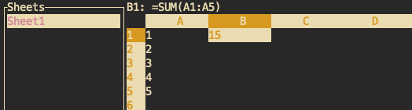

# TironCalc

TironCalc, or Tiron for friends, is a TUI (Terminal User Interface) for IronCalc. Based on [ratatui](https://github.com/ratatui-org/ratatui)



## Build

```
cargo build --release
```

You will find the binary at `./target/release/tiron`.

## Documentation

Start empty project:

```
$ tiron
```

Load an existing Excel file:

```
$ tiron example.xlsx
```
-   `Arrow Keys` to navigate cells
-   `e` to edit a cell and enter the value or formula.
-   `q` to quit and save
-   `+` to add a sheet
-   `s` to go to the next sheet
-   `a` to go to the previous sheet
-   `PgUp/PgDown` to navigate rows faster


## Inspiration

James Gosling of Java fame created [sc](https://en.wikipedia.org/wiki/Sc_(spreadsheet_calculator)) the spreadsheet calculator.

Andrés Martinelli has been maintaining [sc-im](https://github.com/andmarti1424/sc-im), the spreadsheet calculator improvised.
